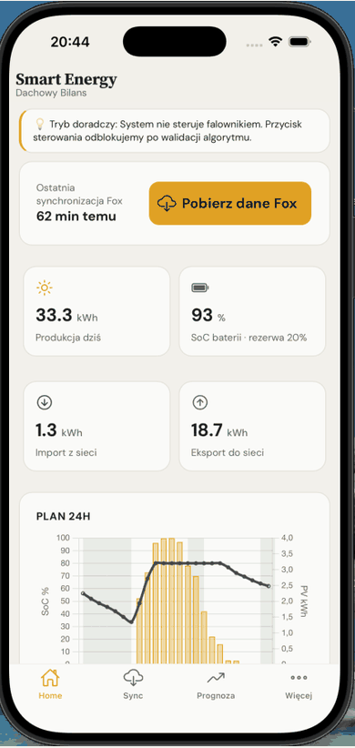
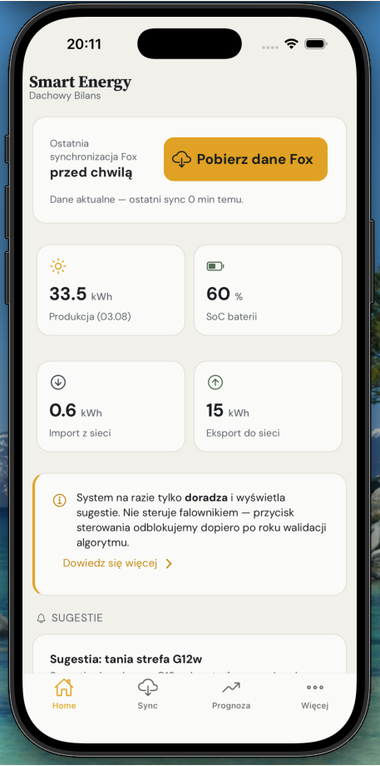
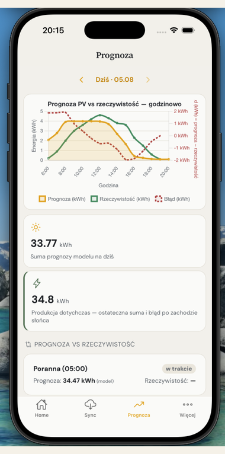
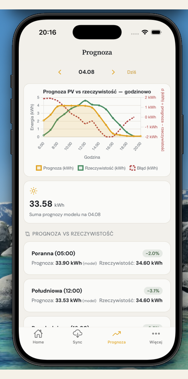
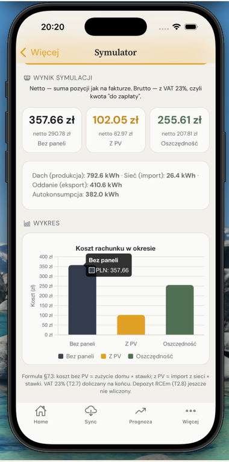

# Smart Energy Model

[](https://github.com/MartaGaluszka/smart-energy-model-public/actions/workflows/ci.yml)

**Autor:** Marta Gałuszka  
**Typ:** projekt portfolio / naukowy (instalacja domowa PV + magazyn FoxESS)  
**Metryki ML / MLOps:** [`docs/STATUS_ML_MLOPS.md`](docs/STATUS_ML_MLOPS.md)

> Kopia publiczna: bez lokalnego `.env`, bez bazy/danych surowych, bez dokładnego GPS/SN instalacji oraz bez prywatnych materiałów na obronę. Notebook prezentacji: [`03_prezentacja_dyplomowa.ipynb`](notebooks/03_prezentacja_dyplomowa.ipynb).

---

## 1. Po co jest to repozytorium

To **projekt portfolio / naukowy** (instalacja domowa PV + magazyn FoxESS).  
Celem nie jest produkt komercyjny ani SaaS, tylko pokazanie umiejętności:

- **analitycznych** — EDA, jakość danych IoT, uczciwa walidacja offline i live,
- **inżynierii danych** — synchronizacja z chmurą, limity API, feature engineering, pipeline godzinowy,
- **programistycznych** — model ML, MLOps na hoście, API + aplikacja mobilna.

Sukces projektu = **powtarzalny pipeline** (dane → model → prognoza → closeout) oraz **użyteczna aplikacja**, która pokazuje te same liczby co **instalacja rzeczywista** — a nie „ładny wykres bez pokrycia w danych”.

---

## Struktura repozytorium

```text
smart-energy-model/
|-- data/raw/          # Dane oryginalne (CSV FoxESS, licznik)
|-- data/processed/    # Dane przetworzone (prognozy, metryki, CSV)
|-- notebooks/         # Jupyter notebooks (EDA, eksperymenty, prezentacja)
|-- src/               # Kod źródłowy (data, features, models)
|-- api/               # FastAPI
|-- mobile/            # Aplikacja mobilna (Ionic / Capacitor)
|-- mlops/             # Produkcja: sync, prognoza, closeout, launchd
|-- scripts/           # Trening, wykresy, analizy
|-- models/            # Zapisane modele (.joblib)
|-- reports/figures/   # Wizualizacje (kopie podglądu: docs/images/ml/)
|-- tests/             # Testy
|-- config/            # Konfiguracja (launchd, crontab)
|-- docs/              # Dokumentacja projektu
```

Mapa skryptów: [`scripts/README.md`](scripts/README.md) · MLOps: [`mlops/README.md`](mlops/README.md)

### Następne kroki

1. **Środowisko** — `python3 -m venv venv`, `source venv/bin/activate`, `pip install -r requirements.txt`, skopiuj `.env.example` → `.env` (szczegóły: [`QUICK_START.md`](QUICK_START.md))
2. **Dane** — import do `data/raw/` albo synchronizacja FoxESS API (README §5 · [`docs/FOXESS_KROK_PO_KROKU.md`](docs/FOXESS_KROK_PO_KROKU.md))
3. **Prezentacja** — [`notebooks/03_prezentacja_dyplomowa.ipynb`](notebooks/03_prezentacja_dyplomowa.ipynb)

Dokumentacja EDA/ML: [`docs/01_EDA_analiza.md`](docs/01_EDA_analiza.md) · [`docs/02_ML_predykcja_PV.md`](docs/02_ML_predykcja_PV.md) · [`docs/03_ZALOZENIA_I_DECYZJE.md`](docs/03_ZALOZENIA_I_DECYZJE.md).

---

## 2. Wartość modelu i aplikacji

### Problem w domu

Instalacja fotowoltaiczna z falownikiem/magazynem **FoxESS** i taryfą strefową (G12w). Pytania dnia:

- ile PV będzie **dziś / jutro**?
- kiedy sensownie **uruchamiać** odbiorniki (pralka, zmywarka…)?
- czy prognoza jest w **tej samej skali**, co licznik w aplikacji FoxESS?

### Co daje model

Godzinowy **Random Forest (16 cech)** przewiduje produkcję PV na horyzoncie **1–3 dni**.

- target = **Δ`PVEnergyTotal`** — ta sama zmienna, co w aplikacji FoxESS (bez sztucznego skalowania `pvPower`),
- pogoda = Open-Meteo **ICON** (współrzędne lokalizacji instalacji w lokalnym `.env`),
- wynik = suma dnia + profil godzinowy → ranking okien na autokonsumpcję.

Szczegóły metryk i walidacji: [`docs/STATUS_ML_MLOPS.md`](docs/STATUS_ML_MLOPS.md) · metoda: [`docs/02_ML_predykcja_PV.md`](docs/02_ML_predykcja_PV.md).

### Co daje aplikacja użytkownika

Aplikacja mobilna (Ionic / Capacitor, `mobile/`) **oraz** API (`api/`) **przekształcają** wyjście modelu w **decyzje na dziś**:

- prognoza produkcji (dziś / kolejne dni),
- profil godzinowy,
- kontekst synchronizacji z FoxESS (czy dane są świeże),
- sugestie / doradztwo (m.in. bateria — tryb doradczy, bez automatycznego sterowania falownikiem w MVP).

To nie jest kolejny widget pogodowy — to **most między modelem a instalacją**, na liczbach porównywalnych **z aplikacją FoxESS**.

```text
Dom (FoxESS) ──Cloud API──► sync / baza ──► cechy + RF ──► prognoza
                                                      │
                                              API + aplikacja mobilna
                                                      │
                                              decyzje użytkownika
```

---

## 3. FoxESS Cloud → przetwarzanie danych

### Dwie ścieżki przechowywania (świadomie)

| Ścieżka | Silnik | Rola |
|---------|--------|------|
| **MLOps (host)** | SQLite `data/energy_model.db` | trening, launchd, closeouty, skrypty `mlops/` |
| **Aplikacja** | **PostgreSQL 16** w Dockerze | API FastAPI + aplikacja mobilna (`docker-compose.yml`) |

Migracja początkowych danych (seed) z SQLite → Postgres: `scripts/migrate_sqlite_to_postgres.py` (przy pierwszym uruchomieniu środowiska aplikacji).

### Przepływ

1. **Pobranie** danych z FoxESS Cloud (klucz API) — timeseries / raporty dzienne.  
2. **Zapis** do bazy (SQLite na co dzień; Postgres pod aplikację).  
3. **Agregacja** do godzinowych delt **PVE** (target ML).  
4. **Pogoda** Open-Meteo ICON → join po czasie i lokalizacji dachu.  
5. **Cechy** (16 produkcyjnych) → model RF → artefakty prognozy.  
6. **Closeout wieczorny** — porównanie prognozy z danymi rzeczywistymi (actual) pochodzącymi z aplikacji FoxESS / timeseries.

Kluczowe skrypty: `mlops/sync_data.py`, `mlops/forecast_pv.py`, `mlops/evening_closeout.py` · opis jobów: [`mlops/README.md`](mlops/README.md).

---

## 4. Jak aplikacja korzysta z danych modelu

| Wejście | Skąd | Co widzi użytkownik |
|---------|------|---------------------|
| Prognoza godzinowa / dzienna | inferencja na podstawie `pv_hourly_model.joblib` przez API (`/api/v1/forecast/…`) + historia prognoz | ekran **Prognoza** — KPI dnia, profil |
| Dane rzeczywiste / stan instalacji | synchronizacja FoxESS → DB → API (`/api/v1/foxess/…`) | produkcja, SoC, status ostatniej synchronizacji |
| Walidacja | closeout / endpoint validation | jakość prognozy względem danych rzeczywistych |

**Raw vs hybryda:**  
- *raw* = sam model na cały dzień (ocena jakości ML offline),  
- *hybryda dnia* = FoxESS na minione godziny + model na przyszłe godziny (obraz „co jeszcze zostanie dziś”) — **bez** korekty ADJUST (wyłączonej).

**Wartość:** użytkownik planuje dzień na podstawie prognozy spójnej z odczytem licznika, a nie na podstawie „przybliżonej pogody z internetu”.

Więcej o produkcie mobilnym: [`docs/PROJEKT_APLIKACJA_MOBILNA.md`](docs/PROJEKT_APLIKACJA_MOBILNA.md).

---

## 5. Jak zdobyć dane z FoxESS i zapełnić bazę (limity API)

Pełna procedura: [`docs/FOXESS_KROK_PO_KROKU.md`](docs/FOXESS_KROK_PO_KROKU.md).

### Wymagania

```bash
cp .env.example .env
# FOXESS_API_KEY=...
# FOXESS_DEVICE_SN=...   # zalecane przy limitach
# WEATHER_LAT / WEATHER_LON = współrzędne GPS dachu
```

**Nie commituj** `.env`.

### Pierwszy import historii

Limit API FoxESS to rzędu **~1440 wywołań / dzień**.  
**Nie pobieraj całego roku jedną komendą.**

```bash
source venv/bin/activate   # macOS: bez tego używaj ./venv/bin/python

# test połączenia
python src/test_connection.py

# paczki miesięczne + pauza między dniami
python src/data/foxess_fetch_all.py --from YYYY-MM-DD --to YYYY-MM-DD --delay 2
```

Zalecenie: **jeden miesiąc na przebieg (run)**; po `✅ Pobieranie zakończone` — kolejny.  
Przy błędzie **40402** (limit): przerwij, poczekaj (często do następnego dnia), wznów **tylko** niedokończony zakres.

Codzienny przyrost (produkcja): `mlops/sync_data.py` / `daily_workflow.sh` — tryb incremental, bez pełnego backfillu.

### Postgres pod aplikację

```bash
docker compose up -d db api
# schemat: db/init/
# opcjonalnie: seed z lokalnej bazy SQLite
./venv/bin/python scripts/migrate_sqlite_to_postgres.py
```

---

## 6. Szybki start — aplikacja mobilna



### Wymagania

**Wspólne (API + dowolny front):**

- Docker Desktop  
- Python venv (`pip install -r requirements.txt`)  
- Node / npm (katalog `mobile/`)  
- uzupełniony plik `.env` (FoxESS, `DATABASE_URL` / compose, `JWT_SECRET`)

**Przeglądarka (dev):** powyższe wystarczy.

**Symulator natywny (Capacitor):**

| Platforma | IDE | Uwagi |
|-----------|-----|--------|
| **iOS** | **Xcode** (macOS) | W repozytorium jest `mobile/ios/` — gotowe pod Simulator |
| **Android** | **Android Studio** | Folder `mobile/android/` trzeba dodać: `npx cap add android` (pierwszy raz) |

API musi działać na hoście (`docker compose up -d db api`). W buildzie dev aplikacja woła `http://127.0.0.1:8000` (działa w iOS Simulator; na emulatorze Android często trzeba ustawić `10.0.2.2:8000` w `mobile/src/environments/environment.ts`).

### Uruchomienie (skrót)

```bash
# 1) Baza + API
docker compose up -d db api
# sprawdź: http://localhost:8000/health  oraz  http://localhost:8000/docs

# 1b) Panel operacyjny Streamlit (lokalnie, opcjonalnie — notatki pogodowe + prognoza vs app)
./venv/bin/streamlit run dashboard/app.py
# http://localhost:8501

# 2a) Aplikacja w przeglądarce (dev)
cd mobile
npm install
npm start
# http://localhost:8100

# 2b) iOS Simulator (Xcode)
cd mobile
npm run build:sim
npx cap sync ios
npx cap run ios
# lub w Xcode: otwórz mobile/ios/App/App.xcodeproj → Run na Simulatorze

# 2c) Android Emulator (Android Studio) — po npx cap add android
cd mobile
npm run build:sim
npx cap sync android
npx cap run android
```

### Pierwsze kroki w aplikacji

1. Zaloguj się (lub użyj konta demo, jeśli jest skonfigurowane).  
2. Sprawdź status **ostatniej synchronizacji** FoxESS — w razie potrzeby pobierz dane (nie przekraczaj limitów API).  
3. Otwórz **Prognoza** — KPI dnia + profil godzinowy.  
4. Przejrzyj prognozę na jutro / kolejne dni, jeśli dostępne.

### Screenshoty (pojedyncze klatki)






### Gdy coś nie działa

| Objaw | Co sprawdzić |
|-------|----------------|
| API nie startuje | `docker compose ps`, logi `api`, `GET /ready` (model + DB) |
| Pusta prognoza | czy jest pogoda i synchronizacja Fox; czy `models/pv_hourly_model.joblib` jest widoczny w kontenerze |
| Fox **40402** | limit API — odczekaj, nie uruchamiaj pełnego backfillu |
| Krzywe godziny / „stare” dane | `TZ=Europe/Warsaw` w compose (zgodność z hostem MLOps) |
| Simulator bez danych z API | czy `db`+`api` działają; iOS: `127.0.0.1:8000` w `environment.ts`; Android emulator: często `10.0.2.2:8000` |
| `cap run ios` / build Xcode | zainstalowany Xcode + `xcode-select`; po zmianach w TS/HTML: `npm run build:sim && npx cap sync ios` |

---

## Skrót techniczny

Szczegóły i tabele: **[`docs/STATUS_ML_MLOPS.md`](docs/STATUS_ML_MLOPS.md)** (jedyna aktualna tabela metryk).

- Model produkcyjny: **RF 16** · PVE · ICON · GPS dachu · shadow CS4 + XGB+TS  
- Offline (okno do 10.08): Test MAE **0,605** · train–test gap **0,029** · okno treningowe → **2026-08-10**  
- Live: closeouty **14.07–10.08** · era dual MAPE raw **9,4%** / **9,2%**  
- MLOps: launchd 5:00 / 12:00 / 16:00 / closeout · retrain niedziela **04:30** — [`mlops/README.md`](mlops/README.md)  
- **CI:** GitHub Actions → `pytest` (30 testów) — [`.github/workflows/ci.yml`](.github/workflows/ci.yml)
- Dokumentacja: [`01` EDA](docs/01_EDA_analiza.md) · [`02` ML](docs/02_ML_predykcja_PV.md) · [`03` decyzje](docs/03_ZALOZENIA_I_DECYZJE.md)

### Dla oceniającego / portfolio

| | |
|--|--|
| Prezentacja (slajdy) | [`notebooks/03_prezentacja_dyplomowa.ipynb`](notebooks/03_prezentacja_dyplomowa.ipynb) |
| Raport wyników | [`reports/model_comparison.md`](reports/model_comparison.md) |
| Green IT (§8) | [`reports/green_it_summary.md`](reports/green_it_summary.md) |
| SHAP (interpretowalność) | [`reports/shap_interpretation.md`](reports/shap_interpretation.md) |
| Założenia | [`docs/03_ZALOZENIA_I_DECYZJE.md`](docs/03_ZALOZENIA_I_DECYZJE.md) |
| Status ML/MLOps | [`docs/STATUS_ML_MLOPS.md`](docs/STATUS_ML_MLOPS.md) |
| FoxESS | [`docs/FOXESS_KROK_PO_KROKU.md`](docs/FOXESS_KROK_PO_KROKU.md) |
| Szybki start aplikacji | [§6 powyżej](#6-szybki-start--aplikacja-mobilna) · projekt: [`docs/PROJEKT_APLIKACJA_MOBILNA.md`](docs/PROJEKT_APLIKACJA_MOBILNA.md) |

---

*Smart Energy Model · ostatnia aktualizacja: 2026-08-11*
