# ML — Predykcja Produkcji Fotowoltaicznej

**Przegląd założeń i decyzji (prezentacja):** [03_ZALOZENIA_I_DECYZJE.md](03_ZALOZENIA_I_DECYZJE.md)

**Notebook:** [`notebooks/02_ML_predykcja_PV.ipynb`](../notebooks/02_ML_predykcja_PV.ipynb)  
**Model produkcyjny:** Random Forest godzinowy (regularyzowany)  
**Artefakt:** `models/pv_hourly_model.joblib`  
**Status:** Podział 80/20 · **16 cech** · target **PVE** · ICON · expanding → **2026-08-10**: Test MAE **0.605** · `.joblib` (train_end **2026-08-08**): **0.624** · [STATUS_ML_MLOPS.md](STATUS_ML_MLOPS.md)

---

## 1. Architektura modelu

### Eliminacja data leakage (Tauron)

**Krytyczna poprawka architektury:** usunięto nocne ładowanie magazynu z sieci (import Tauron) z macierzy cech treningowych. Dane Tauron (`tauron_bills`, `meter_readings`) służą **wyłącznie** do walidacji biznesowej i ROI — **nigdy** jako target ani feature modelu PV. Target treningowy i closeout: **`PVEnergyTotal`** (godzinowe delty licznika z `foxess_timeseries`) — ta sama zmienna co w aplikacji FoxESS.

### 1.1 Model wdrożeniowy

| Element | Wartość |
|---------|---------|
| Algorytm | **Random Forest Regressor** (scikit-learn Pipeline + Imputer) |
| Target | `pv_kwh_hour` = Δ`PVEnergyTotal` / h (`PV_HOURLY_TARGET=pve`) |
| Cechy | 16 (`HOURLY_FEATURE_COLUMNS_PRODUCTION`) — pogoda, słońce, śnieg, mgła; **bez** `month`/`doy_*` |
| Źródło PV | FoxESS `foxess_timeseries` → licznik `PVEnergyTotal` |
| Źródło pogody | Open-Meteo (`weather_data`), model **`icon_seamless`** |
| **Bez Tauron** w treningu | Tauron wyłącznie do walidacji biznesowej |

### 1.2 Strategia walidacji — losowy podział po dniach (80/20)

**Metoda (stała):** podział po **dniach** → `train_test_split(..., test_size=0.2, random_state=42)` · CV `GroupKFold(5)` tylko na train · wybór modelu: **min gap**.

**Źródła w wierszu godzinowym:** FoxESS (`PVEnergyTotal` = target) + Open-Meteo ICON (cechy pogodowe).

```
OKNO BAZOWE (pełny cykl sezonowy — ustalenie strategii)
  Dane                 2025-06-01 → 2026-05-31   (12 mies.)
  Train                ~80% dni (~280) — FoxESS (PV) + Open-Meteo (pogoda)
  Test                 ~20% dni (~70)  — losowo w całym roku

OKNO PRODUKCYJNE (expanding — ta sama metoda 80/20)
  Dane                 2025-06-01 → ostatni dzień FoxESS (obecnie 2026-08-10)
  Ocena offline        Test MAE 0.605 · gap 0.029 · Daily 3.49
  Artefakt .joblib     train_end 2026-08-08 · Test MAE 0.624 · gap 0.057

CV (tuning)            GroupKFold(n=5) po dniach — tylko na zbiorze train
```

**Uzasadnienie:** Podział losowy po **dniach** (nie godzinach) eliminuje wyciek między godzinami tego samego dnia. W przeciwieństwie do holdoutu czasowego, test zawiera dni ze wszystkich sezonów — ocena jest **sezonowo zbalansowana**. W produkcji okno **rośnie** (expanding), ale mechanizm 80/20 zostaje ten sam.

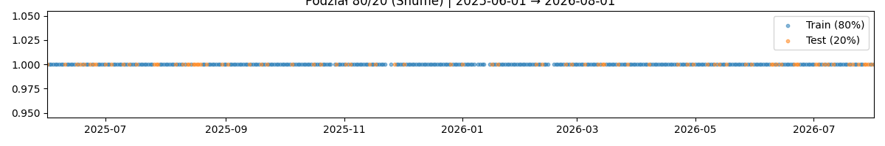

### 1.3 Baseline fizyczny (radiacja × yield)

Punkt odniesienia dla RF: prosta regresja bez wyrazu wolnego

```text
ŷ = radiacja × yield
```

gdzie `yield` (dziennie) lub `coef` (godzinowo) jest **dopasowany wyłącznie na train**:

| Estymator | Wzór |
|-----------|------|
| Mediana (domyślna w raportach) | `median(PV / radiacja)` na train |
| OLS | `Σ(rad·PV) / Σ(rad²)` na train |

W `GroupKFold`: yield per fold z fold-train → MAE OOF (jak przy RF).  
Na Production Holdout: yield z całego Development → ocena na holdoucie.

**Uwaga historyczna:** stała `0.17` (oraz godzinowa `0.0024`) zawyżała „poprawę vs baseline” (~74%), bo systematycznie niedoszacowywała produkcji (~0.6 vs ~16 kWh/d). Po kalibracji (instalacja ~5.39 kWp → yield ≈ 4.3–4.7) poprawa dzienna spada do realistycznych ~20% na CV.

Skrypty: [`final_cv_production_split.py`](../scripts/analysis/final_cv_production_split.py), [`final_cv_production_split_hourly.py`](../scripts/analysis/final_cv_production_split_hourly.py).

---

## 2. Walka z przeuczeniem (Bias–Variance Tradeoff)

> Metryki train/test poniżej odnoszą się do **losowego podziale 80/20 po dniach**. Cross-validation (GroupKFold) stosowana jest **wyłącznie na zbiorze train** podczas GridSearch.

### 2.1 Problem

Pierwsze iteracje RF (`max_depth=15`, `min_samples_leaf=3`) dawały:

| Metryka | Wartość |
|---------|---------|
| Train MAE | 0.337 kWh/h (R² = 0.896) |
| Test MAE | 0.706 kWh/h (R² = 0.591) |
| **Gap** | **0.369 kWh/h** |

Duży spadek R² na teście wskazywał na **zapamiętywanie szumu** w zbiorze treningowym (wariancja >> bias).

### 2.2 GridSearchCV + wybór min-gap

Skrypt: [`scripts/train/train_hourly_model_tuning.py`](../scripts/train/train_hourly_model_tuning.py)

**Siatka regularyzacji:**

```python
max_depth:          [6, 8, 10]
min_samples_leaf:   [10, 15, 20]
min_samples_split:  [20, 30, 40]
max_features:       ['sqrt', 'log2', 1.0]
```

**Procedura:**

1. `GridSearchCV` + `GroupKFold(5)` na **train** — scoring: `neg_mean_absolute_error`
2. Shortlist: kandydaci z CV MAE w tolerancji ±5% od optimum
3. Wybór końcowy: **minimalny gap** (test MAE − train MAE), tie-break: test MAE

### 2.3 Model produkcyjny (po tuningu)

| Parametr | Wartość |
|----------|---------|
| `max_depth` | **6** |
| `min_samples_leaf` | **20** |
| `min_samples_split` | **20** |
| `max_features` | **1.0** |
| `n_estimators` | 200 |
| Pogoda GPS | ~50.0°N, 19.9°E (okolice Krakowa; dokładne współrzędne tylko w lokalnym `.env`) |
| Model OM | **`icon_seamless`** (`OPENMETEO_MODEL`) |
| Target | **Δ`PVEnergyTotal`** (`PV_HOURLY_TARGET=pve`) |
| Okno | expanding → **2026-08-10** (ocena offline) · `.joblib` train_end **2026-08-08** |

| Metryka | ICON + ∫pvPower (2026-07-17) | PVE gate (2026-07-18) | **Expanding → 2026-08-10** | **`.joblib` (weekly 09.08)** |
|---------|------------------------------|------------------------|----------------------------|------------------------------|
| Train MAE | 0.580 | 0.542 | **0.576** | **0.567** |
| Test MAE | 0.666 | 0.582 | **0.605** | **0.624** |
| Test R² | 0.710 | 0.711 | **0.702** | **0.701** |
| **Gap** | 0.086 | 0.040 | **0.029** | **0.057** |
| Daily MAE | 4.61 kWh/d | 3.57 kWh/d | **3.49 kWh/d** | **3.96 kWh/d** |
| Werdykt | ACCEPT (ICON) | milestone PVE (= app) | **✅ nie przeuczony** | **✅ artefakt produkcyjny** |

**Historia (skrót):** GPS dach → ICON (`best_match`→`icon_seamless`, ACCEPT 0.682→0.666 na ∫pvPower) → **target = PVEnergyTotal** (bez skalowania `pvPower`).

Pełna siatka: `data/processed/hourly_model_grid_search_production.csv`  
Changelog: [CHANGELOG_ML.md](CHANGELOG_ML.md) — PVE 2026-07-18 · ICON 2026-07-17.

#### Porównanie operacyjne po ICON (closeout)

Gate offline ≠ closeout live. Stan na wdrożenie ICON (2026-07-17):

| Warstwa | Status |
|---------|--------|
| Live closeout **przed** ICON (14–16.07) | w `forecast_validation.csv` — MAE daily vs app ~**6,4 kWh** |
| Replay archiwum ICON (te same dni) | `forecasts/icon_operational_replay_20260714_16.csv` — MAE RF vs target ML ~**3,7** (before_icon ~4,0); *to nie jest prognoza 5:00* |
| Live closeout **po** ICON | brak wierszy — pierwsze pełne dni od **18.07+**; cel ≥7 dni rolling MAE |

Szczegóły i tabele: [CHANGELOG_ML.md § ICON — porównanie operacyjne](CHANGELOG_ML.md).

---

## 3. Porównanie historyczne — Production Holdout *(archiwum)*

> **Uwaga:** Poniższa sekcja dokumentuje **poprzednią** strategię holdoutu czasowego (dev → 2026-05, test 2026-06+). Od lipca 2026 zastąpiono ją **losowym podziałem 80/20** (§1.2). Wyniki holdoutu pozostają cennym argumentem przeciw XGBoost.

### 3.1 Wykres: „Porównanie modeli PV — Dokładność miesięczna”

Skrypt: [`scripts/compare_models_monthly.py`](../scripts/analysis/compare_models_monthly.py)  
Dane: [`notebooks/monthly_model_comparison.csv`](../notebooks/monthly_model_comparison.csv)

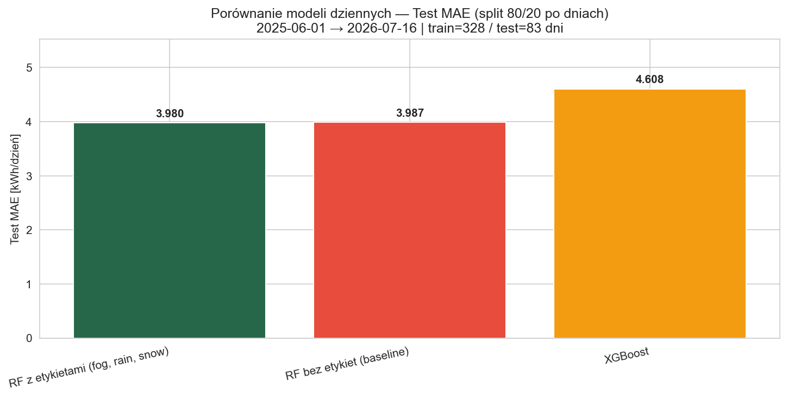

| Model | MAE na dev (2025-06 → 2026-05) | MAE na holdout (**2026-06-01 → 2026-07-09**, 39 dni) |
|-------|-------------------------------|------------------------------------------------------|
| **XGBoost** | ~0.05 kWh/d (**≈0 — podejrzane**) | **5.16 kWh/d** — kolaps |
| **RF + cechy kalibracyjne** | ~1.00 kWh/d | **4.72 kWh/d** — stabilny |
| RF bez cech kalibracyjnych | ~1.00 kWh/d | ~4.67 kWh/d |

**XGBoost** osiągał MAE bliskie zeru na dev — sygnał **całkowitego przeuczenia**. Na holdout błąd wzrósł **~100×**, co dyskwalifikuje algorytm operacyjnie.

**Random Forest** z cechami domenowymi utrzymał porównywalny błąd między dev a holdout.

### 3.2 Wykres szeregów czasowych

Skrypt: [`scripts/plots/plot_pv_timeseries_comparison.py`](../scripts/plots/plot_pv_timeseries_comparison.py)

**Wykres — porównanie modeli** (TRAIN | HOLDOUT, osobne okna; ★ RF `.joblib` na holdoucie):

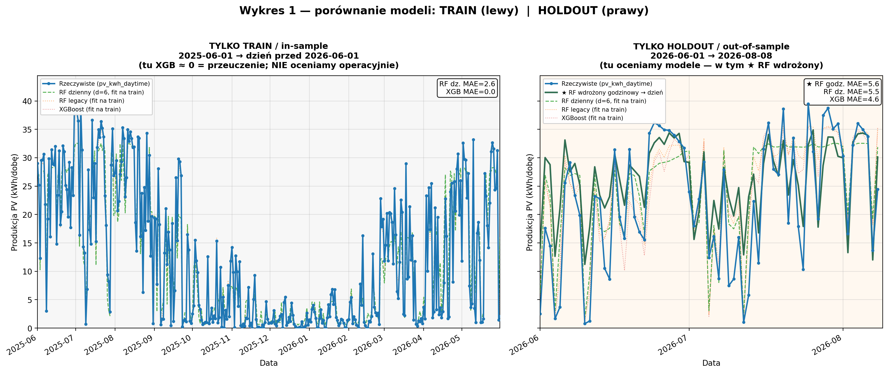

**Wykres — model wdrożeniowy** (te same okna, tylko ★ RF vs rzeczywistość) — w notebooku 02 §9:

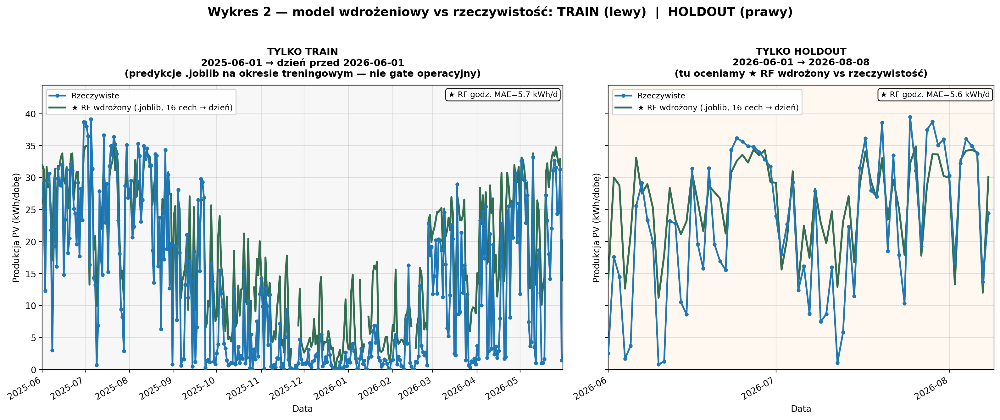

**Operacyjnie (energia dzienna, raw / hybryda):** `production_validation_plot.png`, `july_validation_plot.png` (słupki |błąd|).

**Gap / przeuczenie (2 panele):** `hourly_algorithm_comparison.png` (train vs test MAE + gap).

- **Układ:** lewy = TYLKO TRAIN (`< 2026-06-01`), prawy = TYLKO HOLDOUT — bez wspólnej osi / bez czerwonej kreski w środku.
- **Sty/lut 2026 (naprawione):** wykres używa `pv_kwh_daytime` i świeżych danych po `sync_data.py`
- Wcześniejszy artefakt „prostej linii” wynikał z filtrowania dni + ujemnych wartości `pv_kwh`

---

## 4. Inżynieria cech (Feature Engineering)

Moduł: [`src/features/pv_features_hourly_extended.py`](../src/features/pv_features_hourly_extended.py)

| Grupa cech | Przykłady | Rola |
|------------|----------|------|
| Pogodowe | `radiation_wm2`, `cloud_cover_pct`, `temp_c` | Główny sygnał |
| Słoneczne | `sunrise_hour`, `sun_position`, `hours_until_sunset` | Dynamiczne okno PV |
| Sezonowe | ~~`doy_sin`, `doy_cos`, `month`~~ | **Wycofane** — redundantne wobec radiacji + słońca (§4.2) |
| **Kalibracja śniegu** | `snow_on_panels`, `snow_on_panels_prev` | Model fizyczny topnienia |
| **Kalibracja mgły** | `likely_fog_day` | Heurystyka wilgotność/yield/radiacja |

> **Uwaga:** Zdjęcia z instalacji służą wyłącznie do **walidacji** kalibracji — nie są cechami treningowymi.

Feature importance (model produkcyjny): dominacja `radiation_wm2`, `hours_until_sunset`, `sun_position`.

### 4.1 Studium ablacji — wpływ kolejnych grup cech

Skrypt: [`scripts/ablation_study.py`](../scripts/analysis/ablation_study.py) — jedno uruchomienie generuje `ablation_results.csv`, `calendar_ablation_comparison.csv` i `learning_curves.csv`.

**Dwie ścieżki raportowania:**

| Wykres / CSV | Fazy | Cel |
|--------------|------|-----|
| `ablation_chart.png` | **6 etapów** (pełna ścieżka eksploracyjna) | Historia: kalendarz vs słońce vs legacy |
| `academic_*.png` | **4 etapy** (ścieżka produkcyjna) | Prezentacja akademicka bez kalendarza |
| `calendar_ablation_comparison.png` | **5 wariantów** decyzyjnych | Raport §4.2 |

Grupy cech (pełna ablacja):

| Etap | Cechy | Liczba |
|------|-------|--------|
| **1_Baza** | `hour` | 1 |
| **2_Pogoda** | + temp, wilgotność, chmury, radiacja, wiatr | 6 |
| **3_Kalendarz** | + `doy_sin/cos`, `month` | 9 |
| **3_Pogoda_Slonce** | pogoda + geometria słońca | 13 |
| **★ 3_Pogoda_Slonce_Reguly** | + śnieg, mgła (**produkcja**) | **16** |
| **4_Reguly** | legacy — kalendarz + słońce + reguły | 19 |

**Procedura:** zbiór 2025-06-01 → 2026-05-31, podział 80/20 po dniach (`random_state=42`), RF (`max_depth=8`, `n_estimators=200`).

#### Wynik ablacji (n_estimators=200, run 2026-07-18 · GPS + ICON + target PVE)

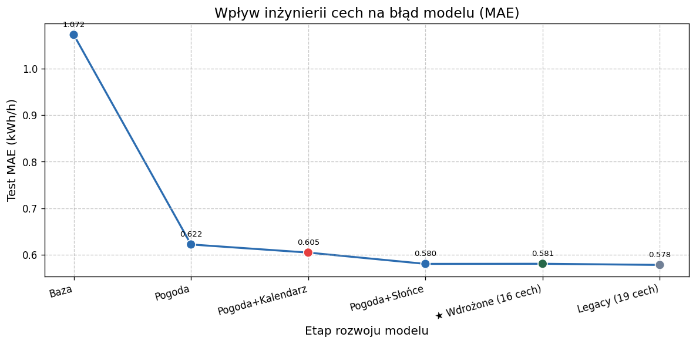

| Etap | Test MAE (kWh/h) | R² | Uwaga |
|------|------------------|-----|-------|
| 1_Baza | **1.072** | 0.258 | sama godzina |
| 2_Pogoda | **0.622** | 0.647 | największy skok |
| 3_Kalendarz | **0.605** | 0.672 | pomaga vs sama pogoda |
| 3_Pogoda_Slonce | **0.580** | 0.691 | bez kalendarza |
| **3_Pogoda_Slonce_Reguly** | **0.581** | **0.690** | **★ wdrożony (16 cech)** |
| 4_Reguly (legacy) | **0.578** | 0.693 | 19 cech — zastąpiony (ΔMAE ≈ 0) |

**Wniosek:** Największy skok daje **pogoda**. Kalendarz pomaga vs pogoda sama, ale **nie bije** ścieżki słońce → produkcja. Model produkcyjny = pogoda + słońce + reguły (**16 cech** ≈ legacy 19).

#### Krzywe uczenia

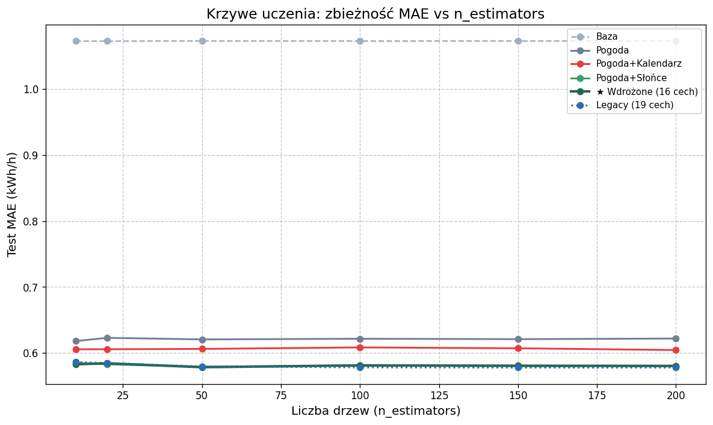

Skrypt: [`scripts/plots/plot_learning_curves.py`](../scripts/plots/plot_learning_curves.py) — **6 faz ablacji** (porównanie etapów cech)  
Wykresy akademickie: [`scripts/plots/plot_academic_evaluation.py`](../scripts/plots/plot_academic_evaluation.py)

**Model wdrożeniowy (16 cech, hiperparametry produkcyjne):**

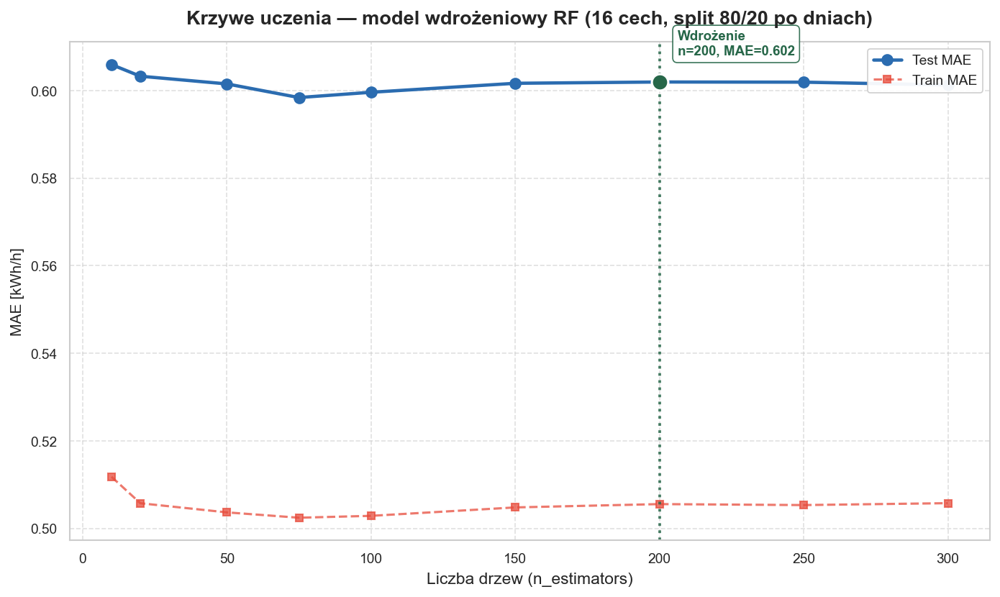

Skrypt: [`scripts/plots/plot_rf_convergence.py`](../scripts/plots/plot_rf_convergence.py) — train/test MAE vs `n_estimators`, split 80/20 po dniach, znacznik `n=200`.

**4 fazy na wykresach akademickich:** Baza → Pogoda → Pogoda+Słońce → **Produkcja (16 cech)**. Metryki: `data/processed/academic_evaluation_metrics.csv`.

- **1_Baza** — płaska krzywa (~1.07 MAE)
- **2_Pogoda** — skok już przy 10 drzewach
- **3_Pogoda_Slonce / Produkcja (16)** — plateau ~0.58 MAE przy 150–200 drzewach
- Model wdrożeniowy (`plot_rf_convergence.py`): n=200 → Test MAE **~0.60** (split ablacyjny)
- Brak przeuczenia — `n_estimators` > 100 nie poprawia MAE na teście

Artefakty: `data/processed/ablation_results.csv`, `data/processed/learning_curves.csv`

#### 4.1.1 Wykresy akademickie — ewaluacja 4 faz (ścieżka produkcyjna)

**Wykres 1: Rzeczywistość vs prognoza** (odpowiednik Accuracy) — siatka 2×2, przekątna y=x, R² w tytule.

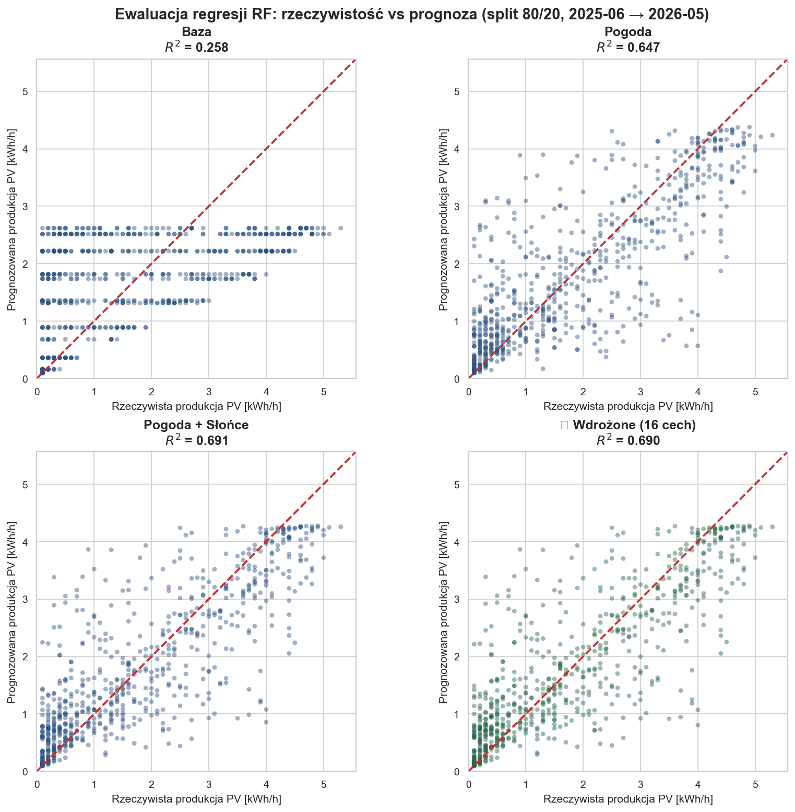

**Wykres 2: Spadek MAE i RMSE** (odpowiednik F1 / Lost Accuracy) — słupki + linie trendu z adnotacjami.

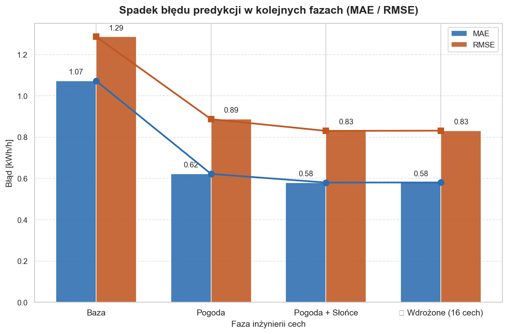

#### 4.2 Raport decyzyjny: optymalizacja zestawu cech produkcyjnych

**Data analizy:** 2026-07-17 (po GPS dach)  
**Notebook:** [`notebooks/02_ML_predykcja_PV.ipynb`](../notebooks/02_ML_predykcja_PV.ipynb) §5.1–5.2  
**Skrypt:** `run_calendar_comparison()` w [`ablation_study.py`](../scripts/analysis/ablation_study.py)  
**Stała w kodzie:** `HOURLY_FEATURE_COLUMNS_PRODUCTION` w [`pv_features_hourly_extended.py`](../src/features/pv_features_hourly_extended.py)

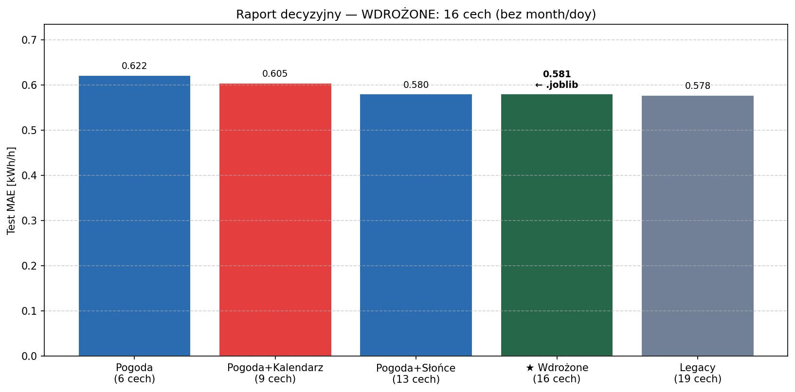

##### Pytanie badawcze

Czy `month` / `doy_sin/cos` są potrzebne w zestawie produkcyjnym, skoro mamy radiację i cechy słoneczne? Czy reguły śnieg/mgła warto zachować bez kalendarza?

##### Metodologia

| Parametr | Wartość |
|----------|---------|
| Zbiór | 2025-06-01 → 2026-05-31 (361 dni, pełny cykl sezonowy) |
| Podział | `train_test_split` po **dniach**, 80/20, `random_state=42` |
| Train / Test | 288 dni (2898 h) / 73 dni (759 h) |
| Model ablacji | RF, `n_estimators=200`, `max_depth=8` |

##### Wyniki porównawcze

| Etap | Cech | MAE [kWh/h] | RMSE | R² | Δ MAE vs Pogoda |
|------|------|-------------|------|-----|-----------------|
| 2_Pogoda | 6 | 0.622 | 0.887 | 0.647 | — |
| 3_Kalendarz | 9 | 0.605 | 0.856 | 0.672 | **−0.017** |
| 3_Pogoda_Slonce | 13 | 0.580 | 0.831 | 0.691 | **−0.042** ✅ |
| **★ 3_Pogoda_Slonce_Reguly** | **16** | **0.581** | **0.831** | **0.690** | **−0.041** ✅ |
| 4_Reguly *(legacy)* | 19 | 0.578 | 0.827 | 0.693 | −0.044 |

##### Wnioski analityczne

1. **Kalendarz (`month`, `doy_sin/cos`) — WYRZUCIĆ z produkcji.**  
   Sam kalendarz poprawia MAE vs sama pogoda (−0.017), ale **nie wnosi nic ponad** Pogoda+Słońce → 16 cech. Legacy 19 cech ≈ Produkcja 16 (0.578 vs 0.581).

2. **Cechy słoneczne — KRYTYCZNE.**  
   `sunrise_hour`, `sun_position`, `hours_until_sunset` itd. obniżają MAE o **−0.042 kWh/h** vs pogoda i podnoszą R² 0.65 → **0.69**. Kodują **faktyczną** pozycję słońca danego dnia.

3. **Reguły śnieg/mgła — ZOSTAWIĆ.**  
   Na średnim MAE teście (`3_Pogoda_Slonce_Reguly` vs `3_Pogoda_Slonce`) różnica ≈ **0** — reguły nie szkodzą. Uzasadnienie operacyjne: poprawa predykcji w **warunkach brzegowych** (zima, mgła), niewidoczna w globalnym MAE lata.

4. **Sobota / dzień tygodnia — NIE dodawać.**  
   Model przewiduje **produkcję PV**, nie zużycie. Pralka w sobotę to decyzja użytkownika (harmonogram AGD), nie cecha falownika.

5. **Legacy `4_Reguly` (19 cech) — zastąpić.**  
   Zestaw produkcyjny (16 cech) jest równoważny (0.581 vs 0.578) i prostszy o 3 cechy.

##### Rekomendacja produkcyjna ★

```python
HOURLY_FEATURE_COLUMNS_PRODUCTION = [
    'hour',
    'temp_c', 'humidity_pct', 'cloud_cover_pct', 'radiation_wm2', 'wind_speed_ms',
    'sunrise_hour', 'sunset_hour', 'day_length_hours',
    'hours_since_sunrise', 'hours_until_sunset', 'sun_position', 'is_daylight',
    'snow_on_panels', 'snow_on_panels_prev', 'likely_fog_day',
]
```

| | Legacy (19 cech) | **★ Wdrożone (16 cech)** |
|--|------------------|------------------------------|
| Kalendarz | ✅ `month`, `doy_*` | ❌ usunięte |
| Słońce | ✅ | ✅ |
| Śnieg / mgła | ✅ | ✅ |
| Test MAE | 0.578 | **0.581** |
| Test R² | 0.693 | **0.690** |

**Wdrożone (artefakt `models/pv_hourly_model.joblib`):** `train_hourly_model_tuning.py` i `PVHourlyPredictor` używają `HOURLY_FEATURE_COLUMNS_PRODUCTION`; target **PVE** — expanding → **2026-08-10**: Test MAE **0.605**, Daily **3.49**; artefakt (train_end **2026-08-08**): Test MAE **0.624**, Daily **3.96** (`pv_hourly_model.metadata.json`, [STATUS_ML_MLOPS.md](STATUS_ML_MLOPS.md)).

Artefakt: `data/processed/calendar_ablation_comparison.csv`

---

## 5. MLOps — pipeline wdrożeniowy

> Szczegóły aktualizacji 2026-07-13: [UPDATE_2026-07-13_16-cech-hybryda.md](UPDATE_2026-07-13_16-cech-hybryda.md)

```
┌─────────────────┐     ┌──────────────────┐     ┌─────────────────────┐
│  sync_data.py   │────►│ energy_model.db  │────►│ train_hourly_model  │
│ FoxESS+OpenMeteo│     │ archive+forecast │     │ _tuning.py (okaz.)  │
└─────────────────┘     └──────────────────┘     └──────────┬──────────┘
                                                            │
┌─────────────────┐     ┌──────────────────┐                ▼
│ daily_workflow  │────►│  forecast_pv.py  │◄─── pv_hourly_model.joblib
│ .sh (launchd 5:00)│   │  hybryda 3 dni   │
└─────────────────┘     └────────┬─────────┘
                                 ▼
                    pv_forecast.csv + ranking godzin AGD
                    (pralka ≥1.5 kW, suszarka ≥2 kW, zmywarka ≥1.2 kW)
```

### 5.1 Skrypty

| Skrypt | Funkcja |
|--------|---------|
| [`sync_data.py`](../mlops/sync_data.py) | Wykrywa luki, pobiera FoxESS + Open-Meteo (archiwum + prognoza) |
| [`train_hourly_model_tuning.py`](../scripts/train/train_hourly_model_tuning.py) | GridSearch + zapis `.joblib` (16 cech) |
| [`forecast_pv.py`](../mlops/forecast_pv.py) | Prognoza dziś + 2 dni + harmonogram urządzeń |
| [`daily_workflow.sh`](../mlops/daily_workflow.sh) | Orkiestracja codzienna (5:00) |
| [`midday_forecast.sh`](../mlops/midday_forecast.sh) | Sync FoxESS + pogoda + prognoza (12:00) |
| [`ablation_study.py`](../scripts/analysis/ablation_study.py) | Ablacja cech + krzywe uczenia + raport kalendarzowy |
| [`plot_calendar_ablation.py`](../scripts/plots/plot_calendar_ablation.py) | Wykres raportu decyzyjnego §4.2 |
| [`plot_academic_evaluation.py`](../scripts/plots/plot_academic_evaluation.py) | Wykresy scatter + MAE/RMSE (4 fazy prod.) |

### 5.2 Prognoza hybrydowa (dziś)

Dla **bieżącego dnia**:

| Okres | Pogoda | Produkcja PV |
|-------|--------|--------------|
| Godziny minione | `OpenMeteo-archive` | FoxESS z bazy (gdy sync zdążył) |
| Godziny przyszłe | `OpenMeteo-forecast` | model RF (16 cech) |

Implementacja: `PVHourlyPredictor.predict_days(hybrid_today=True, use_actual_pv=True)` w [`pv_hourly_predictor.py`](../src/models/pv_hourly_predictor.py).

Kolumny wyjściowe: `prediction_source` (`model` / `foxess_actual`). Ranking AGD tylko dla przyszłych godzin.

**Intuicja operacyjna:** o **5:00** suma dnia ≈ sam RF; o **12:00** / **16:00** hybryda zamienia coraz więcej minionych godzin na FoxESS, a RF zostaje tylko na resztę dnia. **Raw** zawsze = suma RF na cały dzień (także godziny już minione).  
Na wykresach „hybryda” ≠ korekta `FORECAST_OPERATIONAL_ADJUST` (ta jest osobna; w T1 zwykle OFF).

**Target modelu (2026-07-18):** godzinowe **dodatnie delty** licznika `PVEnergyTotal` z `foxess_timeseries` (`PV_HOURLY_TARGET=pve`) — ta sama zmienna co w aplikacji FoxESS / closeout. Opcjonalnie legacy: `PV_HOURLY_TARGET=pvpower` (∫`pvPower`, ~+10–15%).

### 5.5 Korekta operacyjna (2026-07-16)

> Szczegóły i slajdy prezentacji: [UPDATE_2026-07-16_korekta-operacyjna.md](UPDATE_2026-07-16_korekta-operacyjna.md)

Po prognozie RF stosowana jest **własna warstwa operacyjna** (`intraday_forecast_adjust.py`):

1. **Intraday** — skala reszty dnia z porównania FoxESS vs `predicted_kwh_raw` (blend 65%).
2. **Profil błędu** — median `actual/predicted` per godzina z `forecast_validation_hourly.csv`.
3. **Chmury** — dodatkowe obniżenie przy `cloud_cover > 70%`.
4. **Ranking AGD** — na `predicted_kwh_conservative`, nie na surowym szczytie.

Domyślnie włączone w `forecast_pv.py`; wyłączenie: `--no-operational-adjust`.

#### Weryfikacja operacyjna (model vs FoxESS)

Skrypt: [`scripts/plots/plot_production_accuracy.py`](../scripts/plots/plot_production_accuracy.py) — predykcja godzinowa vs rzeczywistość od 2026-06 (**→ 2026-08-10**).

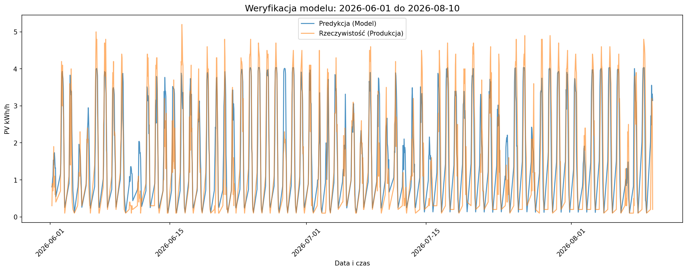

**Raw vs hybryda dnia** (closeouty launchd **14–23.07**):

| Plik | Skrypt |
|------|--------|
| [`july_validation_plot.png`](images/ml/july_validation_plot.png) | `scripts/plots/plot_july_validation.py` |
| [`production_validation_plot.png`](images/ml/production_validation_plot.png) | `scripts/plots/plot_production_validation.py` |

- **Raw** = sam RF na cały dzień · **Hybryda** = FoxESS (minione) + RF (przyszłe) — **nie** `FORECAST_OPERATIONAL_ADJUST`
- Regeneracja: `MPLBACKEND=Agg PYTHONPATH=$PWD python scripts/plots/plot_july_validation.py` (i analogicznie `plot_production_validation.py`)

### 5.3 Automatyzacja — launchd (zalecane na macOS)

Produkcja działa przez **launchd** (nie crontab jako domyślne):

```bash
./mlops/install_launchd.sh           # instalacja
./mlops/install_launchd.sh --status  # status jobów
```

| Godzina | Job | Skrypt |
|---------|-----|--------|
| **5:00** | daily | `mlops/daily_workflow.sh` |
| **12:00** | midday | `mlops/midday_forecast.sh` |
| **16:00** | peak | `mlops/peak_arrival.sh` |
| **22:42** | evening | `mlops/evening_closeout.sh` |
| **niedziela 5:00** | train | `scripts/train/train_hourly_model_tuning.py` |

Logi: `logs/cron.log` (nazwa historyczna) · `logs/train.log`.

Alternatywa Linux / ręczny crontab (te same skrypty):

```cron
0 5 * * * /path/to/smart-energy-model/mlops/daily_workflow.sh >> /path/to/smart-energy-model/logs/cron.log 2>&1
0 12 * * * /path/to/smart-energy-model/mlops/midday_forecast.sh >> /path/to/smart-energy-model/logs/cron.log 2>&1
0 5 * * 0 cd /path/to/smart-energy-model && ./venv/bin/python scripts/train/train_hourly_model_tuning.py >> logs/train.log 2>&1
```

### 5.4 Weryfikacja automatyzacji

```bash
./mlops/install_launchd.sh --status

# Logi z dzisiaj
grep "$(date +%Y-%m-%d)" logs/cron.log
tail -80 logs/cron.log

# Czy prognoza się odświeżyła?
ls -la data/processed/pv_forecast.csv
```

Oczekiwane wpisy w logu:

- `Smart Home PV — daily workflow | … 05:` + `✅ Workflow zakończony pomyślnie`
- `=== Midday refresh | … 12:` + `=== Midday refresh OK ===`

**macOS:** uśpiony Mac o 5:00/12:00 = job **nie wykona się**. Test ręczny: `./mlops/daily_workflow.sh >> logs/cron.log 2>&1`

Szczegóły: [UPDATE_2026-07-13_16-cech-hybryda.md](UPDATE_2026-07-13_16-cech-hybryda.md) · [mlops/README.md](../mlops/README.md)

---

## 6. Uruchomienie

```bash
source venv/bin/activate
cd /path/to/smart-energy-model

# --- Pełny pipeline analityczny (ablacja + wykresy) ---
python scripts/ablation_study.py          # CSV: ablacja + kalendarz + krzywe uczenia
python scripts/plots/plot_error_chart.py        # → docs/images/ml/ablation_chart.png
python scripts/plots/plot_calendar_ablation.py  # → docs/images/ml/calendar_ablation_comparison.png
python scripts/plots/plot_learning_curves.py      # → docs/images/ml/learning_curves.png
python scripts/plots/plot_rf_convergence.py       # → docs/images/ml/production_learning_curves.png
python scripts/plots/plot_academic_evaluation.py  # → docs/images/ml/academic_*.png
python scripts/plots/plot_production_accuracy.py # → docs/images/ml/production_validation.png

# --- Model produkcyjny ---
python scripts/train/train_hourly_model_tuning.py   # 16 cech → pv_hourly_model.joblib

# --- Prognoza operacyjna (hybryda: archiwum + FoxESS) ---
python mlops/forecast_pv.py --days 3 --sync --top 5

# --- Codzienny workflow (jak CRON 5:00) ---
./mlops/daily_workflow.sh
```

> **Uwaga:** `docs/02_ML_predykcja_PV.md` to dokumentacja Markdown — nie uruchamiaj go przez `python`. Używaj komend powyżej.

---

## 7. Decyzja architektoniczna — dlaczego RF, nie XGBoost?

| Kryterium | Random Forest | XGBoost |
|-----------|---------------|---------|
| Stabilność (holdout archiwum) | ✅ | ❌ (kolaps czerwiec 2026) |
| Interpretacja | Feature importance | Trudniejsza |
| Regularyzacja | `max_depth`, `min_samples_*` | Wymaga agresywnego early stopping |
| Operacje MLOps | Pipeline sklearn + joblib | Wymaga osobnej ścieżki |

**Werdykt produkcyjny:** Random Forest z silną regularyzacją i cechami domenowymi.

---

## 8. Powiązane artefakty

| Plik | Opis |
|------|------|
| `models/pv_hourly_model.joblib` | Model produkcyjny |
| `data/processed/hourly_model_tuning_summary.csv` | Metryki końcowe |
| `data/processed/pv_forecast.csv` | Prognoza godzinowa |
| `data/processed/hourly_model_grid_search.csv` | Pełna siatka GridSearch |
| `data/processed/ablation_results.csv` | Wyniki ablacji cech |
| `data/processed/learning_curves.csv` | Krzywe uczenia (4 grupy × n_trees) |
| `images/ml/data_split_viz.png` | Wizualizacja podziału 80/20 |
| `images/ml/ablation_chart.png` | Wykres ablacji MAE |
| `images/ml/learning_curves.png` | Krzywe uczenia (ablacja — 6 faz) |
| `images/ml/production_learning_curves.png` | Krzywe uczenia modelu wdrożeniowego (16 cech, RF) |
| `data/processed/production_learning_curves.csv` | Metryki zbieżności wdrożenia |
| `images/ml/academic_scatter_actual_vs_pred.png` | Scatter: rzeczywistość vs prognoza (Baza → Produkcja 16 cech) |
| [`images/ml/academic_errors_mae_rmse.png`](images/ml/academic_errors_mae_rmse.png) | Spadek MAE/RMSE (4 fazy produkcyjne) |
| `data/processed/academic_evaluation_metrics.csv` | Metryki wykresów akademickich (4 fazy) |
| `images/ml/calendar_ablation_comparison.png` | Kalendarz vs Pogoda+Słońce vs Produkcja |
| `images/ml/production_validation.png` | Predykcja vs FoxESS (operacyjnie, VI → **23.07**) |
| `images/ml/july_validation_plot.png` | Lipiec: actual vs **raw** / **hybryda** (5:00 i 12:00) |
| `images/ml/production_validation_plot.png` | Od 14.07: stabilność raw vs hybryda |
| `images/ml/monthly_model_comparison.png` | Porównanie modeli — MAE miesięczne *(archiwum)* |
| `prediction_vs_actual_train_vs_holdout.png` | Porównanie modeli (TRAIN \| HOLDOUT; ★ RF na holdoucie) |
| `prediction_vs_actual_deployed_train_vs_holdout.png` | (artefakt opcjonalny — nie w narracji prezentacji; ★ RF już na wykresie porównania) |
| `data/processed/calendar_ablation_comparison.csv` | Metryki raportu decyzyjnego |
| [`archive/README.md`](archive/README.md) | Archiwum notatek: split, naming, porównania wersji |
| [`archive/models/`](archive/models/) | Split strategies, naming, test summary |
| [`archive/weather-features/`](archive/weather-features/) | Śnieg, mgła, godziny dynamiczne (historia cech) |

---

## 9. Checklist spójności (2026-08-11)

| Element | Status | Uwaga |
|---------|--------|-------|
| Model 16 cech w kodzie | ✅ | `train_hourly_model_tuning.py`, `PVHourlyPredictor` |
| Target = PVEnergyTotal | ✅ | `PV_HOURLY_TARGET=pve` — trening i closeout |
| Retrening `.joblib` | ✅ | train_end **2026-08-08** · Test MAE **0.624** · expanding → **2026-08-10**: **0.605** |
| Prognoza hybrydowa | ✅ | archiwum + FoxESS + forecast |
| Baza pogody dual-source | ✅ | archive + forecast nie nadpisują się |
| Wykresy ablacji (6 faz) | ✅ | `ablation_chart.png` |
| Wykresy akademickie (4 fazy) | ✅ | `academic_*.png` |
| Raport kalendarzowy | ✅ | `calendar_ablation_comparison.png` |
| launchd 5:00 / 12:00 / 16:00 / 22:42 | ⚙️ | `./mlops/install_launchd.sh --status` + `logs/cron.log` |
| Notebook §2–§4 (holdout) | 📦 archiwum | historyczne — model dzienny / stary holdout |
| Notebook §5.1 | ✅ | raport decyzyjny + kod wykresu |
| `plot_rf_convergence.py` | ✅ | Krzywe uczenia → [`docs/images/ml/production_learning_curves.png`](images/ml/production_learning_curves.png) |
| Rolling MAE vs FoxESS | 🔜 | alert degradacji — kolejny krok |

---

## 10. Kolejne kroki

1. **Monitorowanie produkcyjne** — launchd (`daily_workflow.sh` + `midday_forecast.sh`); śledzenie MAE prognoza vs FoxESS (rolling).
2. **Retrening okresowy** — `train_hourly_model_tuning.py` (GridSearch min-gap), np. co niedzielę.
3. **Alert degradacji** — powiadomienie gdy rolling MAE wzrośnie >15% względem baseline.
4. **Walidacja kalibracji** — zdjęcia wyłącznie jako sanity check (nie trening).

*Ostatnia aktualizacja: 2026-08-11 · Metryki: [STATUS_ML_MLOPS.md](STATUS_ML_MLOPS.md) · Model 16 cech · prognoza hybrydowa*
