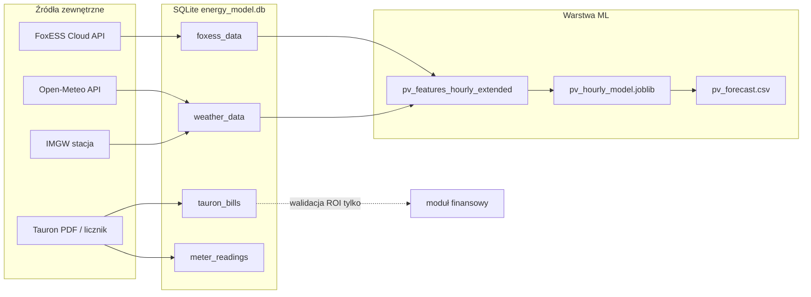
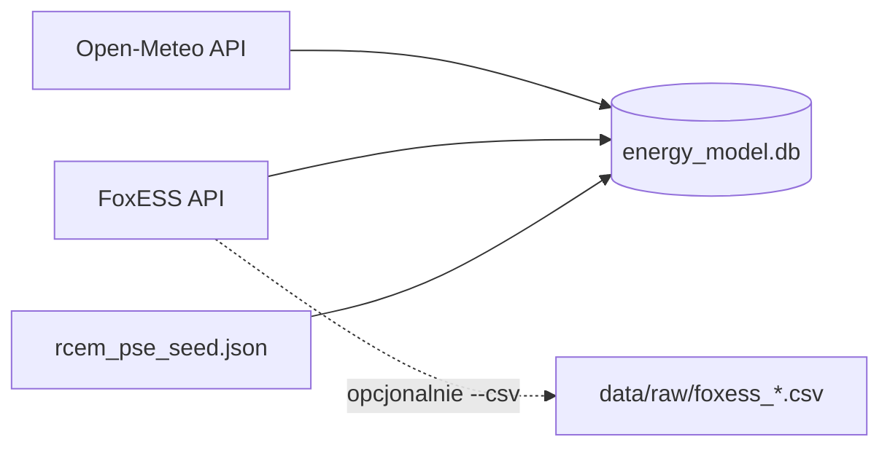
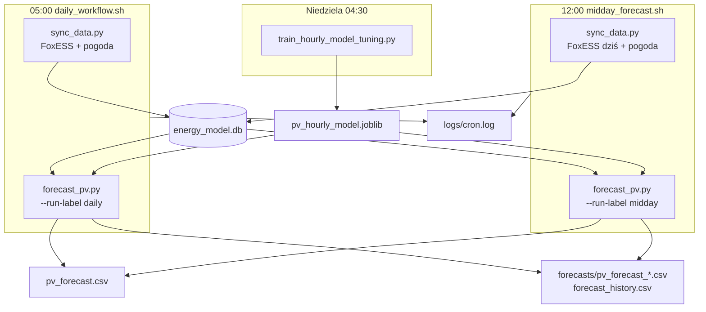

# Założenia projektu i decyzje metodologiczne

**Autor:** Marta Gałuszka  
**Projekt:** Smart Energy Model — predykcja PV + optymalizacja zużycia  
**Status:** lipiec 2026 (model produkcyjny wdrożony)

Ten dokument zbiera **założenia**, **strukturę danych**, **czyszczenie**, **wybór modelu**, **ablację cech (19 → 16)** oraz **synchronizację operacyjną** — w jednym miejscu do prezentacji i obrony projektu.

Powiązane dokumenty:
- [01_EDA_analiza.md](01_EDA_analiza.md) — jakość danych, filtry, luki IoT
- [02_ML_predykcja_PV.md](02_ML_predykcja_PV.md) — pełna dokumentacja ML + MLOps
- [UPDATE_2026-07-13_16-cech-hybryda.md](UPDATE_2026-07-13_16-cech-hybryda.md) — changelog wdrożenia produkcyjnego (hybryda)
- [UPDATE_2026-07-16_korekta-operacyjna.md](UPDATE_2026-07-16_korekta-operacyjna.md) — korekta operacyjna intraday + profil błędu
- [UPDATE_2026-07-17_gps-icon.md](UPDATE_2026-07-17_gps-icon.md) — GPS dach + ICON
- [UPDATE_2026-07-18_skala-app.md](UPDATE_2026-07-18_skala-app.md) — próba skali app (wycofana)
- [UPDATE_2026-07-18_target-pve.md](UPDATE_2026-07-18_target-pve.md) — target ΔPVEnergyTotal
- [UPDATE_2026-07-26_cs4-dual.md](UPDATE_2026-07-26_cs4-dual.md) — dual 16 + CS4 · oneshot tydzień · gate
- [archive/README.md](archive/README.md) — archiwum notatek roboczych (data quality, pogoda, modele, bateria)
- Notebooki: [`01_EDA_analiza_danych.ipynb`](../notebooks/01_EDA_analiza_danych.ipynb), [`02_ML_predykcja_PV.ipynb`](../notebooks/02_ML_predykcja_PV.ipynb)

---

## 1. Założenia projektu

| Założenie | Uzasadnienie |
|-----------|--------------|
| **Target = Δ`PVEnergyTotal`** (`pv_kwh_hour`, `PV_HOURLY_TARGET=pve`) | Ta sama zmienna co w aplikacji FoxESS — trening i closeout bez rozjazdu skali |
| **Tauron poza modelem ML** | Rachunki i licznik służą **walidacji biznesowej / ROI**, nie treningowi — eliminacja data leakage (nocny import z sieci ≠ produkcja PV) |
| **Godziny dynamiczne (wschód–zachód)** | Zamiast sztywnego okna 9–16h — realistyczne okno produkcji sezonowo |
| **Pogoda: Open-Meteo** (~50.0°N, 19.9°E — lokalizacja instalacji w `.env`) | Archiwum + prognoza; GPS; model **`icon_seamless`** (`OPENMETEO_MODEL`) — mniej „gładkich” chmur niż `best_match` |
| **Walidacja modelu: losowy split 80/20 po dniach** | Test sezonowo zbalansowany; CV (GroupKFold) tylko na train przy tuningu |
| **Baseline fizyczny: rad × yield z train** | `yield` = mediana/OLS `PV/radiacja` wyłącznie z train (OOF w CV); stała `0.17` była błędną skalą |
| **Algorytm: Random Forest** | Stabilność vs XGBoost na holdout; interpretowalność; mniejsze ryzyko przeuczenia |
| **Model produkcyjny: 16 cech** | Ablacja: kalendarz redundantny; CS4 (19) gate ACCEPT 2026-07-26, ale **nie** w prod — [`UPDATE_2026-07-26_cs4-dual.md`](UPDATE_2026-07-26_cs4-dual.md) |

---

## 2. Struktura danych wejściowych

Schemat SQL: [`config/database_schema.sql`](../config/database_schema.sql)  
Baza operacyjna: `data/energy_model.db`

### 2.1 Przepływ danych (high-level)



### 2.2 Tabele używane w modelu PV

| Tabela | Kluczowe kolumny | Rola w ML |
|--------|------------------|-----------|
| **`foxess_timeseries`** | `PVEnergyTotal` (licznik kWh) | **Target** (`pv_kwh_hour` = dodatnie delty / h) — jak w app |
| **`foxess_data`** | `timestamp`, `pv_energy_kwh`, `pv_power_kw`, … | sync / legacy; nie jest już źródłem targetu ML |
| **`weather_data`** | `temperature_celsius`, `humidity_percent`, `cloud_cover_percent`, `solar_radiation_wm2`, `wind_speed_ms`, `data_source` | **Cechy pogodowe**; model **`icon_seamless`** |
| `tauron_bills` | zużycie strefowe, koszty | ❌ nie w treningu |
| `meter_readings` | odczyty licznika | ❌ nie w treningu |
| `imgw_daily` | pokrywa śnieżna stacji | walidacja / uzupełnienie flag śniegu |

### 2.3 Ramka treningowa (po feature engineering)

Moduł: [`src/features/pv_features_hourly_extended.py`](../src/features/pv_features_hourly_extended.py)

| Kolumna | Typ | Opis |
|---------|-----|------|
| `day`, `hour` | czas | Agregacja godzinowa |
| **`pv_kwh_hour`** | **target** | Δ`PVEnergyTotal` w godzinie (`PV_HOURLY_TARGET=pve`) |
| `temp_c`, `humidity_pct`, `cloud_cover_pct`, `radiation_wm2`, `wind_speed_ms` | pogoda | Open-Meteo |
| `sunrise_hour`, `sunset_hour`, `day_length_hours`, `hours_since_sunrise`, `hours_until_sunset`, `sun_position`, `is_daylight` | astronomia | biblioteka `astral`, lokalizacja instalacji |
| `snow_on_panels`, `snow_on_panels_prev` | reguła | model topnienia śniegu [`snow_melt_model.py`](../src/features/snow_melt_model.py) |
| `likely_fog_day` | reguła | heurystyka wilgotność + niski yield vs radiacja |

**Zakres treningowy:**
- **Bazowy (ablacja / ustalenie strategii):** 2025-06-01 → 2026-05-31 (pełny rok sezonowy).
- **Produkcyjny (expanding, artefakt `.joblib`):** 2025-06-01 → ostatni dzień FoxESS (obecnie **2026-07-18**), ta sama metoda **80/20 po dniach**.

### 2.3 Ścieżki zapisu danych (skąd trafiają do bazy)

Projekt ewoluował etapami — **nie wszystkie źródła zapisują się tak samo**. To zamierzone uproszczenie operacyjne (lipiec 2026):

| Źródło | Gdzie ląduje | CSV / JSON? | Uwagi |
|--------|--------------|-------------|--------|
| **Open-Meteo** | `weather_data` w SQLite | ❌ tylko baza | API strukturalne; archiwum + prognoza w `data_source` |
| **FoxESS API** | `foxess_data` + `foxess_timeseries` | opcjonalnie `data/raw/foxess_*.csv` | Domyślnie **sync bez CSV**; CSV tylko na żądanie (debug) |
| **RCEm (PSE)** | `rcem_prices` | **`data/rcem_pse_seed.json`** → import | Brak publicznego API — ręczny seed miesięczny |
| **Tauron** | `tauron_bills`, `meter_readings` | skrypty `add_tauron_*.py` | Walidacja finansowa, nie ML |



**FoxESS — tryby zapisu:**

```bash
# Codzienny sync (domyślnie: tylko baza)
python mlops/sync_data.py

# Pełny fetch z backupem CSV (debug / audyt)
python src/data/foxess_fetch_all.py --from 2026-07-01 --to 2026-07-14 --csv

# Tylko baza
python src/data/foxess_fetch_all.py --from 2026-07-01 --to 2026-07-14 --no-csv
```

**Czyszczenie starych CSV FoxESS** (baza nietknięta):

```bash
python scripts/cleanup_foxess_raw.py              # podgląd
python scripts/cleanup_foxess_raw.py --apply      # usuń starsze niż 14 dni
python scripts/cleanup_foxess_raw.py --keep-days 7 --apply
```

Zmienna `.env`: `FOXESS_SAVE_CSV=1` — włącza CSV przy `sync_data.py` (domyślnie wyłączone).

---

## 3. Czyszczenie i przygotowanie danych

Analiza EDA: [01_EDA_analiza.md](01_EDA_analiza.md) · notebook §2–§3

### 3.1 Potok czyszczenia

```
foxess_data (surowe API)
        │
        ▼
Agregacja godzinowa (SUM pv_energy_kwh per hour)
        │
        ▼
Filtr baterii: battery_power_kw >= -0.1 kW
        │
        ▼
Odrzucenie artefaktów dnia (_is_artifact_day — tylko misconfig 21.04–29.05.2025)
        │
        ▼
Okno dynamiczne: tylko godziny z pv_kwh_hour > 0 w zakresie 5–21h + is_daylight
        │
        ▼
Join z weather_data (timestamp + location)
        │
        ▼
Flagi śniegu (model topnienia) + mgły (kalibracja)
        │
        ▼
Macierz X + target pv_kwh_hour
```

### 3.2 Kluczowe decyzje jakościowe

| Problem | Objaw | Rozwiązanie | Dowód |
|---------|-------|-------------|-------|
| Artefakt baterii | PV rośnie gdy bateria się rozładowuje | Filtr `battery_power >= -0.1` | [`archive/battery/UPDATE_2026-07-09_filtr-baterii.md`](archive/battery/UPDATE_2026-07-09_filtr-baterii.md) |
| Sztywne 9–16h | Ucinanie produkcji rano/wieczorem | Dynamiczne wschód–zachód | [`archive/weather-features/DYNAMIC_HOURS_UPDATE.md`](archive/weather-features/DYNAMIC_HOURS_UPDATE.md) |
| „Prosta linia” sty/lut 2026 | Wykres łączy rzadkie punkty | Naprawa filtra + `sync_data.py` | [`archive/data-quality/JAN_FEB_DATA_FIX.md`](archive/data-quality/JAN_FEB_DATA_FIX.md), `diagnose_jan_feb_line.py` |
| Zdrowe zera (śnieg/mgła) | PV ≈ 0 mimo słońca | Flagi `snow_on_panels`, `likely_fog_day` | kalibracja + zdjęcia (walidacja, nie feature) |
| Luki telemetryczne | brak dni w bazie | `sync_data.py` — wykrywanie luk | `scripts/verify_data_completeness.py` |

### 3.3 Zasada „zdrowych zer”

Nie każde PV = 0 to błąd. System rozróżnia:

- **Fizyczne zero** — śnieg na panelach, gęsta mgła (cechy pogodowe + reguły),
- **Artefakt** — rozładowanie baterii księgowane jako PV,
- **Luka IoT** — brak próbek mimo oczekiwanego dnia (wymaga sync).

---

## 4. Droga analizy → wybór Random Forest

### 4.1 Chronologia analiz (skrót)

| Etap | Co zrobiłam | Wynik / wniosek |
|------|-------------|-----------------|
| **EDA** | Pokrycie FoxESS, profile dobowe, PV vs radiacja | Jakość danych wymaga filtrów; sezonowość silna |
| **Model dzienny** | RF na sumie dziennej 9–16h | MAE ~3.6 kWh/d — za mała granularność pod AGD |
| **Model godzinowy (baseline)** | RF 9–16h | Lepszy harmonogram, ale ucinane godziny |
| **Model godzinowy rozszerzony** | Dynamiczne godziny + cechy słoneczne | Lepsze dopasowanie krzywej produkcji |
| **Porównanie XGBoost vs RF** | Holdout czasowy 2026-06+ | XGBoost: MAE≈0 na dev, **5.16 kWh/d** na holdout — przeuczenie |
| **Porównanie algorytmów (godzinowy)** | Ridge / RF / XGB, split 80/20 | `compare_algorithms_hourly.py` → `reports/figures/hourly_algorithm_*.png` (w tym krzywe uczenia) |
| **Decyzja** | RF + cechy domenowe + regularyzacja | Stabilny na holdout (~4.7 kWh/d) |
| **Ablacja cech** | 6 faz (1→19 cech) | Pogoda daje największy skok; kalendarz szkodzi |
| **Tuning GridSearch** | min-gap na train 80% | `max_depth=6`, gap **0.058** (produkcja → 2026-07-18) |
| **Prognoza hybrydowa** | archiwum + FoxESS + forecast | Poprawa operacyjna na „dziś” |
| **Korekta operacyjna intraday** (07-16) | skala z FoxESS rano + profil błędu + chmury | Warstwa nad RF — własny algorytm, bez pluginów |

### 4.2 Dlaczego odrzucono XGBoost

Porównanie miesięczne: [`notebooks/monthly_model_comparison.csv`](../notebooks/monthly_model_comparison.csv) · wykres w [02_ML §3](02_ML_predykcja_PV.md#3-porównanie-historyczne--production-holdout-archiwum)

| Model | MAE dev | MAE holdout (2026-06+) |
|-------|---------|------------------------|
| XGBoost | ~0.05 kWh/d (podejrzanie niski) | **5.16 kWh/d** |
| RF + cechy domenowe | ~1.00 kWh/d | **4.72 kWh/d** |

**Wniosek:** XGBoost zapamiętywał szum na dev; RF z regularyzacją i cechami fizycznymi jest **odporniejszy operacyjnie**.

### 4.3 Dlaczego Random Forest (sklearn Pipeline)

- Obsługa braków (`SimpleImputer`) — luki pogodowe,
- Nieliniowości bez ręcznego feature crossing,
- `feature_importances_` — interpretacja (dominacja `radiation_wm2`, `sun_position`),
- Stabilność przy małej liczbie próbek vs głębokie drzewa gradient boosting,
- Prosty artefakt `.joblib` + przewidywalny czas inferencji (<1 s).

---

## 5. Ablacja cech: od 1 do 19, wybór 16 produkcyjnych

Skrypt: [`scripts/analysis/ablation_study.py`](../scripts/analysis/ablation_study.py)  
Artefakty: `data/processed/ablation_results.csv`, `calendar_ablation_comparison.csv`  
Wykresy: `images/ml/ablation_chart.png`, `images/ml/calendar_ablation_comparison.png`

### 5.1 Pełna ścieżka ablacji (6 etapów)

Procedura: RF `n_estimators=200`, `max_depth=8`, split 80/20 po dniach, `random_state=42`.

| Etap | Zestaw cech | N | Test MAE [kWh/h] | Test R² |
|------|-------------|---|------------------|---------|
| 1_Baza | `hour` | 1 | 1.072 | 0.258 |
| 2_Pogoda | + temp, wilgotność, chmury, radiacja, wiatr | 6 | **0.622** | 0.647 |
| 3_Kalendarz | + `month`, `doy_sin`, `doy_cos` | 9 | 0.605 | 0.672 |
| 3_Pogoda_Slonce | pogoda + geometria słońca | 13 | 0.580 | 0.691 |
| **★ 3_Pogoda_Slonce_Reguly** | + śnieg, mgła | **16** | **0.581** | **0.690** |
| 4_Reguly (legacy) | kalendarz + słońce + reguły | 19 | 0.578 | 0.693 |


**Wnioski** (run 2026-07-18, target PVE):

1. **Największy skok:** dodanie pogody (1 → 6 cech): MAE spada o ~42%.
2. **Kalendarz** pomaga vs sama pogoda, ale **nie bije** ścieżki słońce → 16 cech — `month`/`doy_*` zbędne w produkcji.
3. **16 cech ≈ 19 cech** na teście — reguły śnieg/mgła wartościowe; kalendarz można wyrzucić.
4. Krzywe uczenia: plateau MAE ~0.58 przy 150–200 drzewach.

### 5.2 Raport decyzyjny: 19 → 16 cech


| Wariant | N cech | Test MAE | Rekomendacja |
|---------|--------|----------|--------------|
| 2_Pogoda | 6 | 0.622 | baseline pogodowy |
| 3_Kalendarz | 9 | 0.605 | ❌ (nie do produkcji) |
| 3_Pogoda_Slonce | 13 | 0.580 | blisko optimum |
| **3_Pogoda_Slonce_Reguly** | **16** | **0.581** | **★ wdrożony** |
| 4_Reguly (legacy) | 19 | 0.578 | zastąpiony |

Stała produkcyjna w kodzie:

```python
# src/features/pv_features_hourly_extended.py
HOURLY_FEATURE_COLUMNS_PRODUCTION = [
    'hour',
    'temp_c', 'humidity_pct', 'cloud_cover_pct', 'radiation_wm2', 'wind_speed_ms',
    'sunrise_hour', 'sunset_hour', 'day_length_hours',
    'hours_since_sunrise', 'hours_until_sunset', 'sun_position', 'is_daylight',
    'snow_on_panels', 'snow_on_panels_prev', 'likely_fog_day',
]
```

**Usunięte względem legacy (19 cech):** `month`, `doy_sin`, `doy_cos`.

---

## 6. Model produkcyjny — hiperparametry i wybór

Skrypt: [`scripts/train/train_hourly_model_tuning.py`](../scripts/train/train_hourly_model_tuning.py)  
Artefakt: `models/pv_hourly_model.joblib`

### 6.1 Problem przeuczenia (pierwsze iteracje)

| | Train MAE | Test MAE | Gap |
|---|-----------|----------|-----|
| RF „głęboki” (`max_depth=15`, `min_samples_leaf=3`) | 0.337 | 0.706 | **0.369** |

### 6.2 Procedura GridSearch + wybór min-gap

1. `GridSearchCV` + `GroupKFold(5)` na **zbiorze train** (80% dni),
2. Scoring: `neg_mean_absolute_error`,
3. Shortlist: kandydaci z CV MAE w tolerancji ±5% od optimum,
4. **Wybór końcowy:** minimalny **gap** (test MAE − train MAE), tie-break: test MAE.

Siatka: `max_depth ∈ {6,8,10}`, `min_samples_leaf ∈ {10,15,20}`, `min_samples_split ∈ {20,30,40}`, `max_features ∈ {sqrt, log2, 1.0}`.

### 6.3 Parametry wdrożone (2026-07-18 — GPS + ICON + target PVEnergyTotal)

| Parametr | Wartość |
|----------|---------|
| `n_estimators` | 200 |
| `max_depth` | **6** |
| `min_samples_leaf` | **20** |
| `min_samples_split` | **20** |
| `max_features` | **1.0** |
| `random_state` | 42 |
| Open-Meteo GPS | ~50.0, 19.9 (dokładne w `.env`) |
| `OPENMETEO_MODEL` | **icon_seamless** |
| `PV_HOURLY_TARGET` | **`pve`** (Δ`PVEnergyTotal`) |

| Metryka | Wartość |
|---------|---------|
| Train MAE | **0.536** kWh/h |
| **Test MAE** | **0.594** kWh/h |
| Test R² | **0.694** |
| **Gap** | **0.058** (✅ nie przeuczony) |
| Daily MAE | **3.67** kWh/d |
| Okno | 2025-06-01 → 2026-07-18 (expanding; metoda 80/20) |
| CV MAE | 0.592 ± 0.021 |
| Gate | target = app (PVE); historia ICON ACCEPT 0.682→0.666 |

Pełna siatka: `data/processed/hourly_model_grid_search_production.csv`

---

## 7. Synchronizacja i pipeline operacyjny (MLOps)

Szczegóły: [02_ML §5](02_ML_predykcja_PV.md#5-mlops--pipeline-wdrożeniowy) · [UPDATE_2026-07-13_16-cech-hybryda.md](UPDATE_2026-07-13_16-cech-hybryda.md)

### 7.1 Diagram operacyjny



### 7.2 Co robi `sync_data.py`

| Krok | Działanie |
|------|-----------|
| Wykrywanie luk | `detect_gaps()` — ostatnia data w `foxess_data` / `weather_data` vs dziś |
| Pogoda | `fetch_weather.py` — archiwum + prognoza 3 dni; osobne `data_source` w bazie |
| FoxESS | `foxess_fetch_all.py` — luki historyczne **+ odświeżenie bieżącego dnia** |
| Dry-run | `--dry-run` — audyt bez pobierania |

### 7.3 Prognoza hybrydowa (dziś)

Moduł: [`src/models/pv_hourly_predictor.py`](../src/models/pv_hourly_predictor.py)

| Okres dnia | Pogoda | Produkcja PV |
|------------|--------|--------------|
| Godziny **minione** | `OpenMeteo-archive` | FoxESS z bazy (`foxess_actual`) |
| Godziny **przyszłe** | `OpenMeteo-forecast` | model RF (`model`) |

**Po ludzku (raw vs hybryda na wykresie walidacji):**

| Snapshot | Raw (`predicted_*_raw`) | Hybryda dnia (`predicted_kwh` / suma dnia) |
|----------|-------------------------|--------------------------------------------|
| **05:00** | prawie cały dzień = RF | prawie to samo co raw (za mało godzin z FoxESS) |
| **12:00** | RF na **cały** dzień (także rano) | FoxESS do ~11:00 + RF od 12:00 |
| **16:00** | znowu RF na cały dzień (świeższa pogoda) | FoxESS do ~15:00 + RF od 16:00 |

Im później w ciągu dnia, tym większa część **wykresu godzinowego** to odczyt falownika.  
**Suma dnia (KPI / `forecast_history.predicted_kwh`)** od 29.07.2026: do ~65% godzin z FoxESS
→ **outlook = model raw** (żeby południe nie „padało” gdy rano model zawyżył); potem → ścieżka hybrydowa.  
Env: `FORECAST_HYBRID_LATE_FRAC` (domyślnie 0.65).  
To **nie** jest korekta operacyjna (`FORECAST_OPERATIONAL_ADJUST`) — ta warstwa jest osobna i w T1 domyślnie **OFF**.

### 7.4 Automatyzacja (macOS)

| Czas | Skrypt | Etykieta archiwum |
|------|--------|-------------------|
| **05:00** | `daily_workflow.sh` | `daily` |
| **12:00** | `midday_forecast.sh` | `midday` |
| **Niedziela 04:30** | `train_dual_weekly.sh` (przed daily 05:00) | — |

Instalacja (launchd, zalecane na Macu):

```bash
./mlops/install_launchd.sh
./mlops/install_launchd.sh --status
```

Logi: `logs/cron.log` · archiwum prognoz: `data/processed/forecasts/forecast_history.csv`

### 7.5 Korekta operacyjna prognozy (2026-07-16)

Szczegóły: [UPDATE_2026-07-16_korekta-operacyjna.md](UPDATE_2026-07-16_korekta-operacyjna.md)

Warstwa **nad** modelem RF (bez retreningu):

| Składnik | Moduł | Źródło wiedzy |
|----------|-------|---------------|
| Intraday scale | `intraday_forecast_adjust.py` | FoxESS rano vs `predicted_kwh_raw` |
| Profil błędu godzinowego | `forecast_error_profile.py` | `forecast_validation_hourly.csv` |
| Heurystyka chmur | ten sam moduł | `cloud_cover_pct` z Open-Meteo |
| Ranking AGD | `rank_hours_conservative` | `predicted_kwh_conservative` |

Wieczorem `evening_closeout.py` odbudowuje profil błędu (krok `[5]`).

Porównanie „wczoraj na dziś”:

```bash
grep "2026-07-15" data/processed/forecasts/forecast_history.csv
```

---

## 8. Mapa plików — gdzie szukać czego

| Temat | Pliki |
|-------|-------|
| **Schemat bazy** | `config/database_schema.sql` |
| **Cechy + czyszczenie** | `src/features/pv_features_hourly_extended.py`, `src/features/snow_melt_model.py` |
| **Model + prognoza** | `src/models/pv_hourly_predictor.py`, `src/models/intraday_forecast_adjust.py`, `src/models/forecast_error_profile.py`, `src/models/forecast_archive.py` |
| **Trening / tuning** | `scripts/train/train_hourly_model_tuning.py` |
| **Ablacja** | `scripts/analysis/ablation_study.py`, `data/processed/ablation_results.csv` |
| **Wykresy** | `scripts/plots/plot_*.py`, `reports/figures/*.png` |
| **Sync** | `mlops/sync_data.py`, `scripts/fetch_weather.py`, `src/data/foxess_fetch_all.py`, `scripts/cleanup_foxess_raw.py` |
| **Workflow dzienny** | `mlops/daily_workflow.sh`, `mlops/midday_forecast.sh`, `mlops/peak_arrival.sh`, `mlops/evening_closeout.sh` |
| **EDA / jakość** | `docs/01_EDA_analiza.md`, `notebooks/01_EDA_analiza_danych.ipynb` |
| **ML pełna docs** | `docs/02_ML_predykcja_PV.md`, `notebooks/02_ML_predykcja_PV.ipynb` |
| **Filtr baterii** | [`archive/battery/PV_BATTERY_FILTER.md`](archive/battery/PV_BATTERY_FILTER.md), [`archive/battery/UPDATE_2026-07-09_filtr-baterii.md`](archive/battery/UPDATE_2026-07-09_filtr-baterii.md) |
| **Archiwum notatek** | [`archive/README.md`](archive/README.md) |

---

## 9. Jedna komenda — odtworzenie analiz

```bash
source venv/bin/activate
cd /path/to/smart-energy-model

# Ablacja + wykresy (prezentacja)
python scripts/analysis/ablation_study.py
python scripts/plots/plot_error_chart.py
python scripts/plots/plot_calendar_ablation.py
python scripts/plots/plot_learning_curves.py
python scripts/plots/plot_academic_evaluation.py

# Model produkcyjny + prognoza
python scripts/train/train_hourly_model_tuning.py
python mlops/forecast_pv.py --days 3 --run-label manual

# Sync operacyjny
./mlops/daily_workflow.sh
```

---

## 10. Podsumowanie decyzji (elevator pitch)

1. **Dane:** FoxESS (`PVEnergyTotal`) + Open-Meteo ICON; Tauron tylko do ROI; dynamiczne godziny słońca.  
2. **Algorytm:** Random Forest — odporny na przeuczenie vs XGBoost na holdout.  
3. **Cechy:** 16 produkcyjnych (pogoda + słońce + śnieg/mgła), bez kalendarza — potwierdzone ablacją.  
4. **Tuning:** GridSearch min-gap → `max_depth=6`, Test MAE **0.594** kWh/h (target PVE, okno → 2026-07-18).  
5. **Operacje:** **launchd** 4× dziennie (5/12/16/22:42), prognoza hybrydowa, korekta intraday (opcjonalnie), archiwum + walidacja wieczorna.  
6. **Wkład operacyjny:** własna warstwa korekty nad RF (profil błędu z walidacji, bez kopiowania kodu z integracji HA).

---

## 11. Kierunek dopracowania (VII 2026): przedziały czasowe (Lekcja 38/39)

**Kontekst:** MLflow pokazał, że dokładanie cech pogodowych (CS4, geometria, UKMO) daje małe skoki, a błędy >1 kWh skupiają się w **przedziale 10:00–16:00** i na dniach ≥30 kWh (np. 28.07 po sync 12:00). Prowadzący kursu podkreślał **przedziały czasowe** — to staje się główną osią dopracowania.

### Co już jest
| Element | Stan |
|---------|------|
| Okno treningu | expanding → rolling 24 mies. (`ml_train_window.py`) |
| Retrain | **niedziela** `train_dual_weekly.sh` (RF 16 + CS4 + XGB+TS) |
| Live shadow | CS4 (`*_cs4`) + **XGB+TS** (`*_xgb_ts`) obok produkcji RF 16 |
| Sync danych | 05/12/16 + wieczór (nie = retrain) |
| Holdout czasowy | train &lt; 2026-06, test ≥ 2026-06 |
| Walk-forward miesięczny (v1) | `scripts/train/train_walk_forward_mlflow.py` |
| **Walk-forward v2** (VII–VIII 2026) | `scripts/train/train_walk_forward_v2_mlflow.py` → CSV + wykresy + MLflow |
| Cechy TS (lag/rolling 3h NWP) | `train_holdout_and_ts_mlflow.py` |
| Wagi / model szczytu | `train_time_window_peak_mlflow.py` |
| **Peak + top-k (VIII 2026)** | `train_peak_topk_mlflow.py` → MLflow `pk_*` + `topk_metrics.py` |

**Walk-forward v2** (dopracowanie pod prezentację 7.08.2026):
1. **Krok weekly** (pon–niedz) zgrany z niedzielnym retrainem + nadal **monthly**.
2. **Okno train**: `expanding` vs `rolling12` w każdym foldzie.
3. **Werdykt gap** per fold (`ok` / `lekkie` / `przeuczony`) + peak / high-day.
4. Artefakty: `data/processed/walk_forward_v2.csv`, `walk_forward_v2_summary.csv`, wykresy w `reports/figures/walk_forward_v2_*.png`.

### Bramka przed promocją kandydata (zamiast samego shuffle 80/20)
Kandydat (XGB/UKMO/TS/wagi) może wejść do **live shadow** dopiero gdy:
1. **Walk-forward v2** (średnia po foldach monthly + weekly): test MAE i gap **nie gorsze** niż RF produkcji, oraz  
2. **Holdout czerwiec+**: brak kolapsu (gap &lt; ~0,35; nie wraca wzorzec starego XGB), oraz  
3. Metryka **peak_mae / high_day_mae** nie pogarsza się vs baseline (cel projektu: godziny największej produkcji).

Produkcja (`.joblib` + launchd) **nie** przełączamy bez 1–2 tygodni shadow.

### Roadmapa (kolejność)
1. **Przedział godzin szczytu** — wagi sample / osobny model 10–16 (w toku w MLflow `tw_*`).  
2. **Walk-forward v2** jako standardowa ewaluacja przy każdym kandydacie (expanding vs rolling12, weekly).  
3. Live shadow zwycięzcy **XGB+TS** (obok RF 16 + CS4) — `forecast_xgb_ts_shadow.sh`.  
4. Dopiero potem ewentualna podmiana produkcji / UKMO.
