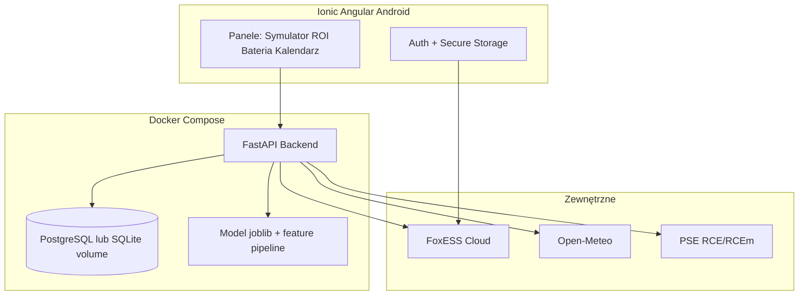

# Dokumentacja projektowa — Smart Energy Mobile (Angular + Ionic)

**Wersja:** 0.3  
**Data:** 2026-07-25  
**Status:** draft do implementacji  
**Powiązane:** [ZADANIA_IMPLEMENTACJA_MOBILNA.md](ZADANIA_IMPLEMENTACJA_MOBILNA.md) (FastAPI **TA.***; advise/push MVP **T4.11+**)

**Cel:** Aplikacja mobilna Android (Ionic + Angular) korzystająca z istniejącego backendu danych, bazy i modelu ML PV z repozytorium `smart-energy-model`.

**Design:** motyw **Solar Graphite** (jasny, bursztyn + grafit; zieleń tylko jako akcent „oszczędność”).

---

## 1. Cel produktu

Aplikacja pomaga gospodarstwu z PV + magazynem (FoxESS) i rozliczeniem **net-billing / G12w (Tauron)**:

1. Symulować rachunek „tylko Tauron” vs rzeczywistość z autokonsumpcją.
2. Liczyć **ROI / czas zwrotu** na realnym profilu zużycia, nie na folderze sprzedawcy.
3. Optymalizować strategię baterii zimą (ładowanie w taniej strefie, rozładowanie w szczycie) z prognozą PV.
4. Dawać kontekst domowy (kalendarz, sezony, tryby behawioralne).

**Nie kopiujemy UI FoxESS** — własna marka, jasna paleta, inna nawigacja i typografia.

---

## 2. Gotowość względem obecnego projektu

| Warstwa | Stan w repo | Co trzeba dodać pod appkę |
|---------|-------------|---------------------------|
| Dane FoxESS | Sync API key → SQLite (`foxess_*`) | REST API + auth użytkownika; opcjonalnie OAuth (patrz §5) |
| Pogoda | Open-Meteo → `weather_data` | Endpointy prognozy pod optymalizator |
| ML PV | RF `models/pv_hourly_model.joblib` (16 cech, target PVE) | Serwis inference (FastAPI) + cache prognoz |
| Tauron | `tauron_bills`, `tauron_tariff`, skrypty importu | Formularz UI + API CRUD |
| G12w | `src/optimization/g12w_tariff.py` | API stref + okien ForceCharge |
| ROI | `src/financial/roi_calculator.py`, `prosumer_deposit.py`, RCEm | API symulacji + parametry CAPEX |
| Dashboard | Streamlit MVP (notatki / prognoza) | Osobna app Ionic — Streamlit zostaje ops |
| Docker | **brak** | `docker-compose` (DB + API) |
| OAuth Fox | Dziś: **API key** (`FOXESS_API_KEY`) | Spike: czy FoxESS Cloud daje OAuth2; fallback: powiązanie klucza w panelu |

**Werdykt:** dane i logika biznesowa są wystarczająco dojrzałe do projektu i MVP API. Brakuje warstwy mobilnej, Dockera i ujednoliconego backendu HTTP.

---

## 3. Design system — Solar Graphite

### 3.1 Tokeny kolorów

| Token | Hex | Użycie |
|-------|-----|--------|
| `--bg` | `#F2F0EB` | tło aplikacji |
| `--surface` | `#FAFAF8` | karty, bottom sheet |
| `--text` | `#1A1D21` | tytuły, wartości |
| `--text-muted` | `#5C636A` | podpisy |
| `--border` | `#E3DFD6` | ramki |
| `--solar` | `#E6A012` | CTA, PV, primary |
| `--solar-pressed` | `#C9860A` | hover/press |
| `--moss` | `#4F6F52` | **tylko** oszczędność / plus / ROI OK |
| `--grid` | `#3D4450` | pobór z sieci, serie „Tauron” |
| `--cost` | `#C45C26` | koszt / ostrzeżenie |

### 3.2 Typografia i UI

- Tytuły: serif z charakterem (np. Source Serif 4)
- UI: DM Sans / Satoshi
- Karty: cienka ramka, bez ciężkich cieni
- Wykresy: PV = `--solar`, sieć = `--grid`, oszczędność = `--moss`
- Unikać: granatu, cyanu FoxESS, fioletowych gradientów, „eco green” na całym ekranie

### 3.3 Branding vs FoxESS

- Własna nazwa (np. **Smart Energy** / **Dachowy Bilans**)
- Brak logo Fox, brak layoutu 1:1 aplikacji Cloud
- Dane Fox = źródło IoT; UI = produkt dyplomowy/domowy

---

## 4. Architektura docelowa



### 4.1 Stack

| Element | Wybór |
|---------|--------|
| Frontend | **Angular + Ionic** (Android first; Capacitor) |
| Backend | **FastAPI** (Python) — owija istniejące `src/*` |
| ML | ten sam `pv_hourly_model.joblib` + `src/features/*` |
| DB w Docker | **PostgreSQL 16** (produkcja app) *lub* SQLite na volume na MVP; migracja schematu z `config/database_schema.sql` |
| Sync Fox | joby w API / worker / cron w kontenerze (jak `mlops/`) |
| Wykresy | ApexCharts / Chart.js / ECharts w Ionic |

### 4.2 Kontenery (propozycja `docker-compose`)

- `db` — Postgres + volume
- `api` — FastAPI + mount `models/`
- `worker` (opcjonalnie) — sync FoxESS / Open-Meteo / RCE
- `admin` (opcjonalnie) — obecny Streamlit tylko lokalnie, nie w sklepie

---

## 5. Logowanie i FoxESS (OAuth 2.0)

**Wymaganie produktowe:** logowanie OAuth 2.0 do chmury Fox.

**Stan faktów w projekcie:** integracja oparta o **private API key** (API Management), nie o OAuth Authorization Code.

**Plan bezpieczeństwa:**

1. **Spike:** sprawdzenie dokumentacji FoxESS OpenAPI — czy jest OAuth2 / OIDC dla aplikacji trzecich.
2. Jeśli **tak:** Authorization Code + PKCE w Ionic → token w Secure Storage → backend wymienia / przechowuje refresh token w vault użytkownika.
3. Jeśli **nie / ograniczone:**
   - logowanie do **Waszej** aplikacji (OAuth2 własny IdP: Keycloak / Auth0 / Google),
   - w panelu użytkownika: **powiązanie konta Fox** przez wklejenie API key (szyfrowane at-rest) + opcjonalnie Device SN,
   - dokumentacja uczciwie opisuje ograniczenie API Fox.

**Zasada PII:** w DB nie trzymać nazwy stacji / SN w plaintext do prezentacji; SN tylko w vault API.

---

## 6. Panel użytkownika — procesy bazowe

### 6.0 Ekran startowy / sync

- Status ostatniego sync FoxESS (`foxess_device_meta.fetched_at`)
- Przycisk **Pobierz dane Fox** → `POST /api/v1/foxess/sync` (zakres dat)
- Status modelu ML + ostatnia prognoza dzienna
- KPI: produkcja dziś, SoC baterii, import/export dziś

---

## 7. Moduł 1 — Symulator Rachunków (Tauron vs Autokonsumpcja)

### 7.1 Zasada

Formularz stawek z faktury + historyczne logi falownika → porównanie kosztów.

### 7.2 Pola UI

- Opłata stała / abonament [zł/mies.]
- Energia strefa 1 / 2 [zł/kWh netto lub brutto — przełącznik]
- Dystrybucja strefa 1 / 2
- Moc umowna / opłata mocowa (opcjonalnie)
- Okres symulacji: miesiąc / rok / „ostatnie N miesięcy”

Zapis → `tauron_tariff` + wersjonowanie w `user_tariff_overrides`.

### 7.3 Logika (backend)

Źródła: `foxess_data` / `foxess_timeseries` (loads, feedin, gridConsumption, pvPower), opcjonalnie `meter_readings` / `tauron_bills`.

```
koszt_bez_PV ≈ sum(import_symulowany × stawki) + opłaty_stałe
  gdzie import_symulowany ≈ loads (zużycie domu) — gdyby 100% z sieci

koszt_z_PV ≈ sum(grid_import × stawki) + opłaty_stałe
  − wartość_depozytu(export × RCEm)   # net-billing

oszczędność = koszt_bez_PV − koszt_z_PV
```

### 7.4 Wizualizacja

- Wykres **słupkowy grupowany**: „Bez paneli” (`--grid`/`--cost`) vs „Z PV” (`--solar`) vs „Oszczędność” (`--moss`)
- Mini tabela: kWh z dachu / z sieci / oddane

### 7.5 Mapowanie kodu

- `FinancialAnalyzer` — `src/financial/roi_calculator.py`
- Depozyt — `src/financial/prosumer_deposit.py`
- Stawki — tabela `tauron_tariff`

---

## 8. Moduł 2 — Kalkulator ROI

### 8.1 Zasada

Roczne ROI i **lata do zwrotu** z realnych oszczędności (Moduł 1), nie z folderu sprzedawcy.

### 8.2 Wejścia użytkownika

- CAPEX instalacji [zł] (PV + falownik + opcjonalnie bateria osobno)
- OPEX roczny (serwis)
- Inflacja energii % (opcjonalnie)
- Tryb: „ostatnie 12 miesięcy z danych” **lub** „annualizacja z dostępnych miesięcy”

### 8.3 Wyjścia

- Oszczędność roczna [zł]
- ROI % = oszczędność_roczna / CAPEX
- Payback [lata]
- Porównanie z „założeniem sprzedawcy” (pole ręczne do kontrastu)

### 8.4 Wizualizacja

- Gauge / big number payback
- Wykres skumulowanych oszczędności vs CAPEX (linia przecięcia = zwrot)

---

## 9. Moduł 3 — Optymalizator Baterii (strategia zimowa)

### 9.1 Zasada

Suwaki G12w + plan ładowania nocą / rozładowania w szczycie; decyzja „czy ładować z sieci dziś w nocy” zależna od prognozy słońca (Open-Meteo + model RF).

### 9.2 UI

- Suwaki: cena strefa 1 / 2, sprawność baterii, min SoC rano, max DoD
- Toggle: zima / lato
- Timeline 24h: okna tanie (`g12w_tariff`) vs plan SoC

### 9.3 Algorytm (MVP → later) — tryb wyłącznie doradczy

**Zasada produktowa (MVP i okres walidacji ~1 rok):** system **tylko doradza**. Nie wysyła komend ForceCharge / WorkMode do falownika. Użytkownik widzi sugestie (dashboard + push) i **kontrfaktyczne oszczędności** („ile BYŚMY zaoszczędzili, gdyby automatyka była włączona”). Przycisk fizycznego sterowania jest **ukryty / zablokowany** do czasu potwierdzenia jakości algorytmu.

**MVP (reguły + powiadomienia):**

- Wylicz plan: force charge w oknach z `weekday_force_charge_windows()`, rozładuj w zone1, rezerwa SoC
- Wyświetl plan na dashboardzie + **push** z sugestią (np. „Dziś wieczorem warto naładować magazyn w taniej strefie 22:00–6:00”)
- Policz i pokaż `shadow_savings_pln` — oszczędność hipotetyczna vs faktyczne zachowanie instalacji
- Stały komunikat UI (banner): dlaczego pełna automatyka nie jest jeszcze dostępna (patrz §9.6)

**v2 (ML, nadal doradczo):**

- Prognoza PV jutro (`pv_hourly_model` + Open-Meteo)
- Jeśli jutro PV_forecast > próg → sugestia: **nie** ładuj nocą z sieci (lub mniej)
- Jeśli jutro słabo → sugestia: ładuj w taniej strefie do SoC_target

**v3 (po ~roku testów, osobna decyzja produktowa):**

- Odblokowanie przycisku sterowania falownikiem (opt-in + audit log) — poza zakresem MVP

### 9.4 Wizualizacja

- Wykres liniowy: SoC planowany, cena strefy (schodek), PV forecast
- Kolory: ładowanie `--solar`, rozładowanie `--moss`, sieć `--grid`

### 9.5 Mapowanie kodu

- `src/optimization/g12w_tariff.py`
- `mlops/foxess_control.py` — **nie wywoływać w MVP**; tylko dokumentacja przyszłego mostu
- Analizy: `scripts/analysis/analyze_charging_scenarios.py`

### 9.6 Polityka „advise-only” i komunikat dla użytkownika (MVP)

**Stanowisko produktu (do umieszczenia w UI i w docs obrony):**

> Mój system na razie tylko doradza i wyświetla powiadomienia na dashboardzie. Pokazuje, ile BYŚMY zaoszczędzili, gdybyśmy włączyli automatykę. Dopiero gdy po roku testów upewnię się, że algorytm się nie myli, udostępnię przycisk do fizycznego sterowania falownikiem.

**Wymagania UI (MVP):**

1. **Banner / karta stała** na ekranie Bateria (i skrót na Home): powyższy komunikat (skrócona wersja + „Dowiedz się więcej”).
2. **Powiadomienia push** z sugestiami zarządzania baterią i zmagazynowaną energią (okno taniej strefy, unikaj ładowania gdy jutro dużo PV, rezerwa SoC przed szczytem).
3. **Licznik kontrfaktyczny** `shadow_savings_pln` (dzień / miesiąc / YTD): różnica między kosztem faktycznym a kosztem przy wykonanym planie doradczym.
4. Przycisk „Steruj falownikiem” — **niedostępny** (disabled + tooltip z §9.6); brak wywołań API sterujących.

**Dlaczego nie pełna automatyka „na teraz” (punkty do ekranu „Dowiedz się więcej”):**

- Ryzyko kosztowe przy błędzie algorytmu (ładowanie w droższej strefie, zbędny import).
- Limit i niestabilność API FoxESS; brak dojrzałego OAuth sterowania w produkcie.
- Konieczność zebrania sezonu zimowego + letniego pod walidację shadow vs reality.
- Odpowiedzialność użytkownika / bezpieczeństwo instalacji (opt-in dopiero po dowodach).

---

## 10. Kontekst domowy

### 10.1 Kalendarz kontekstowy

- Wakacje, urodziny, „przetwory”, ferie
- Tabela `household_events` (data, typ, wpływ: ↑zużycie / ↓zużycie / tryb_ferie)

### 10.2 Strategia sezonowa

| Sezon | Cel | Dane |
|-------|-----|------|
| Lato | Klimatyzacja vs bateria / autokonsumpcja PV | loads + PV + SoC |
| Zima | Arbitraż G12w + ciepło (podłogówka) przy zachowaniu Wi‑Fi / standby | zone + bateria |

### 10.3 Wsparcie behawioralne (MVP: push + dashboard)

- **Push (MVP):** sugestie baterii / magazynu — tania strefa G12w, nocne ładowanie, rozładowanie przed szczytem, „jutro dużo PV — nie ładuj z sieci”
- Push (faza 2): „Włącz tryb Ferie” / „Standby przed wyjazdem”
- Wszystkie alerty są **doradcze**; nie zmieniają WorkMode falownika (patrz §9.6)

### 10.4 Formuła klimatyzacji

Parametry użytkownika: moc AC [kW], SoC_now, SoC_min_morning, pojemność baterii [kWh], sprawność.

```
energia_dostępna = (SoC_now − SoC_min_morning)/100 × pojemność × sprawność
czas_AC_h = energia_dostępna / moc_AC
```

UI pokazuje: „Bezpiecznie możesz odpalić klimatyzację ~X h bez dokupowania w szczycie”.

---

## 11. Dodatkowe moduły — z danych projektu

| Moduł | Skąd | Wartość |
|-------|------|---------|
| **Prognoza PV dziś/jutro** | RF + Open-Meteo + `forecast_history` | rdzeń produktu |
| **Closeout vs app Fox** | walidacja PVE | zaufanie do modelu |
| **Notatki pogodowe** | `weather_notes` | jakość dni „dziwnych” |
| **Depozyt net-billing / RCEm** | `rcem_prices`, `prosumer_deposit` | „ile kasy w drodze” |
| **Jakość danych / luki IoT** | EDA, `FOXESS_RELIABLE_START` | komunikaty „brak danych” |
| **Porównanie modeli pogody** | ICON vs UKMO (analizy) | zaawansowane / settings |
| **Raport miesięczny PDF** | agregacja foxess + bills | na koniec miesiąca |
| **Alerty limitu API Fox** | 40402 w fetch | ops w telefonie |

**Priorytet MVP mobilnego:** Sync + Symulator + ROI + Prognoza PV + **doradczy optymalizator baterii** (plan + push + shadow savings + banner „brak automatyki”) + komunikat advise-only. Kalendarz kontekstowy i sterowanie fizyczne — później.

---

## 12. Interfejs API HTTP (FastAPI)

Warstwa HTTP jest **jedynym kontraktem** między aplikacją Ionic a istniejącym kodem Pythona (`src/*`, `mlops/*`, model `.joblib`). Implementacja: **FastAPI** + Uvicorn, dokumentacja interaktywna OpenAPI pod `/docs` (Swagger) i `/redoc`.

Szczegółowe zadania: [ZADANIA_IMPLEMENTACJA_MOBILNA.md](ZADANIA_IMPLEMENTACJA_MOBILNA.md) — sekcja **Faza 0.2 / Faza API**.

### 12.1 Zasady kontraktu

| Zasada | Opis |
|--------|------|
| Wersjonowanie | Prefiks **`/api/v1/...`** (breaking changes → `/api/v2`) |
| Format | JSON (`application/json`), daty ISO-8601 (`YYYY-MM-DD` / UTC ISO) |
| Auth | `Authorization: Bearer <JWT>` na endpointach chronionych; `/health`, `/docs` publiczne |
| Błędy | Jednolity shape: `{ "detail": "...", "code": "FOXESS_RATE_LIMIT", "request_id": "..." }` |
| Idempotencja | Sync Fox z tym samym zakresem dat = upsert (bez duplikatów) |
| PII | Odpowiedzi overview **bez** prawdziwego SN / nazwiska — placeholder `REDACTED` |
| Owinięcie | Endpointy wołają istniejące funkcje; **bez** przepisywania ML do TypeScript |

### 12.2 Struktura pakietu `api/`

```
api/
  __init__.py
  main.py                 # FastAPI app, CORS, lifespan (load model)
  deps.py                 # DB session, current_user, settings
  config.py               # pydantic-settings z env
  schemas/                # Pydantic request/response
    auth.py
    foxess.py
    forecast.py
    tariff.py
    simulate.py
    roi.py
    battery.py
    household.py
    deposit.py
    common.py             # ErrorResponse, HealthResponse
  routers/
    health.py
    auth.py
    foxess.py
    forecast.py
    tariff.py
    simulate.py
    roi.py
    battery.py
    household.py
    deposit.py
  services/               # cienkie adaptery → src.*
    foxess_sync.py
    forecast_ml.py
    bill_simulator.py
    roi_service.py
    battery_planner.py
  middleware/
    request_id.py
```

### 12.3 Katalog endpointów (`/api/v1`)

#### Health / meta

| Metoda | Ścieżka | Auth | Opis |
|--------|---------|------|------|
| `GET` | `/health` | nie | Liveness: status, wersja API, ping DB |
| `GET` | `/ready` | nie | Readiness: DB + plik modelu `.joblib` |

#### Auth

| Metoda | Ścieżka | Auth | Opis |
|--------|---------|------|------|
| `POST` | `/api/v1/auth/login` | nie | Login → access + refresh JWT |
| `POST` | `/api/v1/auth/refresh` | refresh | Nowy access token |
| `POST` | `/api/v1/auth/logout` | tak | Unieważnienie refresh (opcjonalnie) |
| `POST` | `/api/v1/auth/fox/callback` | tak* | Callback OAuth Fox (jeśli dostępne) |
| `POST` | `/api/v1/auth/fox/link` | tak | Powiązanie zaszyfrowanego API key Fox |
| `DELETE` | `/api/v1/auth/fox/link` | tak | Odłączenie konta Fox |

#### FoxESS (dane)

| Metoda | Ścieżka | Auth | Opis |
|--------|---------|------|------|
| `POST` | `/api/v1/foxess/sync` | tak | Body: `{ "start": "YYYY-MM-DD", "end": "YYYY-MM-DD" }` → sync historii |
| `GET` | `/api/v1/foxess/overview` | tak | Query: `day=` → KPI: PV, SoC, import, export, `fetched_at` |
| `GET` | `/api/v1/foxess/timeseries` | tak | Query: `day=`, `variables=` (opcjonalnie) → punkty do wykresów |

#### Prognoza ML

| Metoda | Ścieżka | Auth | Opis |
|--------|---------|------|------|
| `GET` | `/api/v1/forecast/hourly` | tak | Query: `day=` → szereg godzinowy kWh + suma dnia |
| `GET` | `/api/v1/forecast/validation` | tak | Query: `day=` → prognoza vs actual / closeout (jeśli jest) |

#### Taryfa i symulacja rachunku

| Metoda | Ścieżka | Auth | Opis |
|--------|---------|------|------|
| `GET` | `/api/v1/tariff/rates` | tak | Aktualne / ostatnie stawki użytkownika |
| `POST` | `/api/v1/tariff/rates` | tak | Zapis stawek z faktury Tauron |
| `POST` | `/api/v1/simulate/bill` | tak | Body: okres + opcjonalne override stawek → `cost_no_pv`, `cost_with_pv`, `savings_pln`, kWh |

#### ROI

| Metoda | Ścieżka | Auth | Opis |
|--------|---------|------|------|
| `GET` | `/api/v1/roi/assumptions` | tak | CAPEX / OPEX / inflacja |
| `PUT` | `/api/v1/roi/assumptions` | tak | Zapis założeń |
| `POST` | `/api/v1/roi/calculate` | tak | Payback, ROI %, seria skumulowanych oszczędności |

#### Bateria (advise-only w MVP)

| Metoda | Ścieżka | Auth | Opis |
|--------|---------|------|------|
| `GET` | `/api/v1/battery/settings` | tak | SoC min, sprawność, sezon, ceny z1/z2 |
| `PUT` | `/api/v1/battery/settings` | tak | Zapis ustawień |
| `GET` | `/api/v1/battery/plan` | tak | Query: `date=` → okna G12w + plan SoC 24h (**bez** komend do falownika) |
| `GET` | `/api/v1/battery/night-charge-advice` | tak | Sugestia ładowania nocnego + uzasadnienie PL |
| `GET` | `/api/v1/battery/shadow-savings` | tak | Query: `from=`, `to=` → `shadow_savings_pln` (kontrfakt: gdyby wykonano plan) |
| `GET` | `/api/v1/battery/policy` | tak | Stały tekst / kod polityki advise-only (§9.6) |
| `POST` | `/api/v1/battery/ac-runtime` | tak | Body: moc AC → `hours_safe` (formuła klimatyzacji) |
| `GET` | `/api/v1/notifications` | tak | Lista sugestii (in-app feed na dashboard) |
| `POST` | `/api/v1/notifications/push-token` | tak | Rejestracja FCM/APNs token |
| — | ~~`POST /battery/control`~~ | — | **Celowo nie istnieje w MVP** |

#### Dom / depozyt / notatki

| Metoda | Ścieżka | Auth | Opis |
|--------|---------|------|------|
| `GET` | `/api/v1/household/events` | tak | Lista wydarzeń (zakres dat) |
| `POST` | `/api/v1/household/events` | tak | Dodanie wydarzenia |
| `DELETE` | `/api/v1/household/events/{id}` | tak | Usunięcie |
| `GET` | `/api/v1/deposit/summary` | tak | Wolny depozyt + pending RCEm |
| `GET` | `/api/v1/weather-notes` | tak | Lista notatek |
| `POST` | `/api/v1/weather-notes` | tak | Nowa notatka (port ze Streamlit) |

### 12.4 Przykładowe kontrakty (Pydantic)

**`GET /api/v1/foxess/overview?day=2026-07-25`**

```json
{
  "day": "2026-07-25",
  "pv_kwh": 34.4,
  "soc_percent": 62.0,
  "grid_import_kwh": 1.2,
  "grid_export_kwh": 18.5,
  "load_kwh": 12.0,
  "device_sn_display": "REDACTED",
  "last_synced_at": "2026-07-25T16:00:46Z"
}
```

**`POST /api/v1/simulate/bill`**

```json
{
  "period_start": "2026-06-01",
  "period_end": "2026-06-30",
  "vat_mode": "gross",
  "rates_override": null
}
```

```json
{
  "cost_no_pv_pln": 420.50,
  "cost_with_pv_pln": 15.94,
  "savings_pln": 404.56,
  "import_kwh": 36.0,
  "export_kwh": 514.0,
  "self_consumed_kwh": 280.0,
  "deposit_credit_pln": 140.42
}
```

### 12.5 Mapowanie FastAPI → kod istniejący

| Router / service | Moduł źródłowy |
|------------------|----------------|
| `services/foxess_sync.py` | `src/data/foxess_fetch_all.py`, `src/data/foxess_api.py` |
| `services/forecast_ml.py` | `src/models/pv_hourly_predictor.py`, features, `models/pv_hourly_model.joblib` |
| `services/bill_simulator.py` | `src/financial/roi_calculator.py`, `prosumer_deposit.py` |
| `services/roi_service.py` | `FinancialAnalyzer` |
| `services/battery_planner.py` | `src/optimization/g12w_tariff.py` |
| weather notes | `src/data/weather_notes.py` |
| RCEm / depozyt | `src/data/rcem.py`, `src/financial/prosumer_deposit.py` |

### 12.6 Uruchomienie (docelowe)

```bash
# w Docker
docker compose up db api

# lokalnie (dev)
uvicorn api.main:app --reload --host 0.0.0.0 --port 8000
# OpenAPI: http://localhost:8000/docs
```

Ionic (dev) wskazuje `API_BASE_URL=http://<LAN-IP>:8000`.

---

## 13. Model danych (rozszerzenia)

Obok obecnego schematu:

- `app_users`, `user_secrets` (encrypted Fox token)
- `user_tariff_overrides`
- `household_events`
- `roi_assumptions` (CAPEX, OPEX)
- `battery_strategy_settings`
- `notifications` (feed sugestii advise-only)
- `push_subscriptions`
- `advice_events` (log pod walidację roczną shadow vs reality)

Migracja: Alembic / SQL skrypt z `database_schema.sql` → Postgres.

---

## 14. Bezpieczeństwo i prywatność

- Brak PPE / adresu / nazwiska w logach UI
- SN falownika tylko w vault
- HTTPS, PKCE, short-lived access tokens
- **MVP: brak endpointów sterujących falownikiem**; sync = read-only (+ przyszły vault klucza)
- Sterowanie fizyczne (ForceCharge) — dopiero po okresie walidacji ~1 rok, osobna zgoda opt-in (poza MVP)

---

## 15. Fazy wdrożenia (orientacyjnie)

| Faza | Zakres | Czas |
|------|--------|------|
| 0 | Spike OAuth Fox + Docker DB/API skeleton | 1–2 tyg. |
| 1 | Ionic shell + Solar Graphite + sync overview + prognoza | 2–3 tyg. |
| 2 | Symulator rachunków + formularz stawek | 2 tyg. |
| 3 | ROI | 1 tyg. |
| 4 | Optymalizator baterii **doradczy** (plan + banner §9.6 + shadow savings) + **push sugestii (MVP)** | 2–3 tyg. |
| 5 | ML decyzja ładowania nocnego (nadal advise-only) + kalendarz | 2 tyg. |
| 6 | Sterowanie Fox — **po ~roku testów**, za zgodą | poza MVP |

Szczegółowa lista zadań: [ZADANIA_IMPLEMENTACJA_MOBILNA.md](ZADANIA_IMPLEMENTACJA_MOBILNA.md).

---

## 16. Kryteria sukcesu MVP

- Użytkownik loguje się i widzi dzisiejszą produkcję / SoC z bazy po sync.
- Symulator pokazuje 2 słupki + oszczędność na ≥1 pełnym miesiącu danych.
- ROI zwraca payback z CAPEX użytkownika.
- Plan baterii na jutro uwzględnia okna G12w (i opcjonalnie prognozę PV).
- **Banner advise-only** (§9.6) widoczny; brak możliwości fizycznego sterowania.
- **Push / feed sugestii** zarządzania baterią i magazynem działa (lub co najmniej in-app na dashboardzie).
- Widoczny licznik **shadow savings** („ile BYŚMY zaoszczędzili przy automatyce”).
- UI zgodne z Solar Graphite; brak elementów brandingu FoxESS.

---

## 17. Ryzyka

| Ryzyko | Mitygacja |
|--------|-----------|
| Brak OAuth u Fox | Własne OAuth + API key vault |
| Limit API Fox (40402) | Cache DB, sync rzadziej, worker z backoff |
| SQLite vs Postgres | Docker Postgres + migracja |
| Sterowanie baterią = ryzyko kosztowe / błędny algorytm | **MVP tylko doradztwo + shadow savings**; fizyczne sterowanie po ~roku walidacji |
| Użytkownik oczekuje „automatu od razu” | Stały komunikat UI (§9.6) + transparentny licznik hipotetycznych oszczędności |
| Model ML „nie na telefonie” | Inference tylko na backendzie |
| Push (FCM) złożoność na Android | MVP: in-app feed + opcjonalnie FCM; nie blokować reszty MVP |

---

## 18. Nawiązanie do dokumentacji istniejącej

- Założenia ML: [03_ZALOZENIA_I_DECYZJE.md](03_ZALOZENIA_I_DECYZJE.md)
- FoxESS: [FOXESS_KROK_PO_KROKU.md](FOXESS_KROK_PO_KROKU.md)
- API key dziś: [API_CONFIGURATION.md](API_CONFIGURATION.md)
- G12w: `src/optimization/g12w_tariff.py`
- Zadania implementacji: [ZADANIA_IMPLEMENTACJA_MOBILNA.md](ZADANIA_IMPLEMENTACJA_MOBILNA.md)
