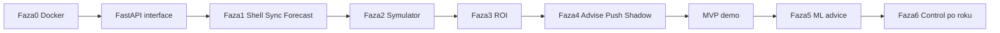

# Zadania implementacji — Smart Energy Mobile

**Wersja:** 0.5  
**Data:** 2026-07-28  
**Dokument nadrzędny:** [PROJEKT_APLIKACJA_MOBILNA.md](PROJEKT_APLIKACJA_MOBILNA.md) (§9.6 advise-only, §12 FastAPI)

Legenda statusu: `[ ]` do zrobienia · `[~]` w toku · `[x]` gotowe  
Priorytet: **P0** blokuje MVP · **P1** MVP · **P2** faza 2 · **P3** nice-to-have

---

## Faza 0 — Fundament (infra + auth spike)

### 0.1 Docker i baza

| ID | Pri | Zadanie | Uwagi / Definition of Done |
|----|-----|---------|----------------------------|
| T0.1 | P0 | `[x]` Dodać `docker-compose.yml` z usługą `db` (PostgreSQL 16 + volume) | Kontener wstaje, healthcheck OK — **napisane i przejrzane, ale NIE uruchomione end-to-end** (brak dostępnego Docker daemon w środowisku implementacji, patrz UPDATE_2026-07-26_fastapi-oauth-spike.md) |
| T0.2 | P0 | `[x]` Dodać usługę `api` (FastAPI) montującą `models/` i kod `src/` | `GET /health` → 200 — zweryfikowane lokalnie przez `uvicorn`/`TestClient` (bez Dockera, patrz uwaga wyżej) |
| T0.3 | P0 | `[x]` Migracja schematu z `config/database_schema.sql` → Postgres (skrypt SQL) | Tabele FoxESS / weather / tauron istnieją — `db/init/001_core_schema.sql`; **niewykonane na żywym Postgresie** (brak Dockera lokalnie), zweryfikowane tylko manualnym przeglądem SQL |
| T0.4 | P1 | `[x]` Skrypt importu lokalnego SQLite → Postgres (jednorazowy seed) | `scripts/migrate_sqlite_to_postgres.py` — **przetestowany na żywym Postgresie w Dockerze (2026-07-26)**: batch insert (`execute_values`, wcześniej wiersz-po-wierszu było niepraktycznie wolne dla `foxess_data`/`foxess_timeseries`), izolacja pojedynczych uszkodzonych wierszy. `foxess_timeseries` (10.7 mln wierszy, nieużywane przez `api/*`) domyślnie pominięte. Zaimportowano: 139 908 `foxess_data`, 61 964 `foxess_report_daily`, 11 136 `weather_data` (10 752 wiersze pominięte — pre-existing przesunięcie kolumn w danych z okresu 2025-04→2026-07, do zbadania osobno), 14 492 `rce_prices`, reszta tabel domenowych. Szczegóły: `docs/UPDATE_2026-07-26_foxess-incremental-sync.md`. |
| T0.5 | P1 | `[x]` `.env.example` pod Docker (`DATABASE_URL`, sekrety) | Bez sekretów w git — zrobione, tylko placeholdery |
| T0.6 | P2 | Usługa `worker` (cron/Celery) pod sync Fox / pogodę | Poza zakresem tej fazy (P2) |

### 0.2 Backend — interfejs HTTP FastAPI

Dokumentacja kontraktu: [PROJEKT_APLIKACJA_MOBILNA.md](PROJEKT_APLIKACJA_MOBILNA.md) §12.

| ID | Pri | Zadanie | DoD |
|----|-----|---------|-----|
| T0.7 | P0 | `[x]` Utworzyć pakiet `api/` wg struktury §12.2 (`main.py`, `deps.py`, `config.py`, `routers/`, `schemas/`, `services/`) | Import `uvicorn api.main:app` OK — zweryfikowane lokalnie w venv (Python 3.9) |
| T0.7a | P0 | `[x]` `GET /health` + `GET /ready` (DB + obecność `pv_hourly_model.joblib`) | 200 gdy gotowe; 503 gdy brak modelu/DB — pokryte testem |
| T0.7b | P0 | `[x]` Włączyć OpenAPI: `/docs` (Swagger) + `/redoc`; tagi routerów po domenach | Wszystkie ścieżki `/api/v1` widoczne — zweryfikowane `test_openapi_docs_available` |
| T0.7c | P0 | `[x]` Wspólny model błędu `ErrorResponse` + middleware `request_id` | Każdy 4xx/5xx ma `detail` + `code` + `request_id` — `api/errors.py`, `api/middleware/request_id.py`, testowane |
| T0.7d | P0 | `[x]` Prefiks wersji `/api/v1` na routerach (APIRouter `prefix="/api/v1/..."`) | Brak endpointów biznesowych poza `/api/v1` (poza `/health`, `/ready`, `/docs`) |
| T0.8 | P0 | `[x]` Warstwa DB (SQLAlchemy) + dependency `get_db` | Działa z SQLite (dev, zweryfikowane) i z `DATABASE_URL=postgresql+psycopg2://...` (kod gotowy — **połączenie z realnym Postgresem w Docker Compose niezweryfikowane**, brak Dockera w środowisku) |
| T0.9 | P0 | `[x]` Owinięcie istniejących funkcji w `api/services/*` bez przepisywania ML | Import `src.models`, `src.financial`, `src.data` — bez modyfikacji logiki ML |
| T0.10 | P0 | `[x]` CORS + ustawienia pod Ionic (localhost / Capacitor / LAN IP) | `CORSMiddleware` sterowany `CORS_ORIGINS`; **preflight OPTIONS nieprzetestowany z realnej appki Ionic** (mobile/ rozwijane równolegle przez innego workera) |
| T0.10a | P1 | `[x]` `pydantic-settings` / `api/config.py` z `DATABASE_URL`, `JWT_SECRET`, `CORS_ORIGINS`, ścieżka modelu | `.env` + `.env.example` zaktualizowane |
| T0.10b | P1 | `[x]` Lifespan FastAPI: załadowanie modelu joblib raz przy starcie (cache w `app.state`) | `api/main.py::lifespan` — `app.state.pv_model` |
| T0.11 | P1 | `[x]` Redakcja PII przy zapisie/odczycie meta Fox w odpowiedziach API | `device_sn_display="REDACTED"` w `api/services/foxess_sync.py` |
| T0.11a | P1 | `[x]` Testy kontraktu (pytest + `TestClient`) | 13 testów, wszystkie zielone lokalnie (patrz sekcja "Śledzenie postępu" niżej) |

### 0.2b Endpointy FastAPI — implementacja routerów

Każdy wiersz = router + schematy Pydantic request/response + serwis adapter.

| ID | Pri | Endpointy | DoD |
|----|-----|-----------|-----|
| TA.1 | P0 | `[x]` **Auth:** `POST /api/v1/auth/login`, `/refresh`, `/logout` (+ `/register`, dodatek MVP pod testowalność) | JWT access+refresh; pokryte testem `test_login_flow_and_refresh` |
| TA.2 | P1 | `[~]` **Auth Fox:** `POST/DELETE /api/v1/auth/fox/link` | Klucz szyfrowany at-rest (Fernet), pokryte testem round-trip; `/fox/callback` **NIE zaimplementowany** — celowo, patrz spike w `UPDATE_2026-07-26_fastapi-oauth-spike.md` (FoxESS nie udostępnia OAuth dla 3rd-party) |
| TA.3 | P0 | `[x]` **FoxESS:** `POST /api/v1/foxess/sync`, `GET .../overview`, `GET .../timeseries` | Cienkie adaptery nad `src/data/foxess_fetch_all.py`; SN redagowany (`device_sn_display=REDACTED`) |
| TA.4 | P0 | `[x]` **Forecast:** `GET /api/v1/forecast/hourly`, `GET .../validation` | Inference z joblib (`PVHourlyPredictor`); happy-path testowany (skip gdy brak lokalnych danych pogodowych) |
| TA.5 | P0 | `[x]` **Tariff:** `GET/POST /api/v1/tariff/rates` | `api/routers/tariff.py` — CRUD `user_tariff_overrides` z fallbackiem na stawki domyślne |
| TA.6 | P0 | `[x]` **Simulate:** `POST /api/v1/simulate/bill` | Response: cost_no_pv / cost_with_pv / savings; happy-path testowany (skip gdy brak danych FoxESS) |
| TA.7 | P0 | `[x]` **ROI:** `GET/PUT /api/v1/roi/assumptions`, `POST /api/v1/roi/calculate` | Owinięcie `FinancialAnalyzer` z `src/financial/roi_calculator.py` |
| TA.8 | P0 | `[x]` **Battery (advise-only):** settings, plan, night-charge-advice, ac-runtime, **policy**, **shadow-savings** | Brak `POST .../control` (zweryfikowane testem `test_battery_control_endpoint_does_not_exist`); `automation_enabled=false` (testowane) |
| TA.8a | P0 | `[x]` **Notifications:** `GET /api/v1/notifications`, `POST .../push-token` | Feed sugestii z seedem dla nowych użytkowników; testowane (≥1 sugestia) |
| TA.9 | P1 | `[x]` **Household:** `GET/POST/DELETE /api/v1/household/events` | CRUD wydarzeń zaimplementowany (poza zakresem P0, ale zrobione przy okazji) |
| TA.10 | P1 | `[x]` **Deposit:** `GET /api/v1/deposit/summary` | Owinięcie `src/financial/prosumer_deposit.py` |
| TA.11 | P2 | Poza zakresem tej fazy (P2, zgodnie z priorytetyzacją zadania) | — |
| TA.12 | P1 | `[~]` Opisanie wszystkich endpointów w OpenAPI (summary, response_model) | Każdy endpoint ma `summary` + `response_model`; **`description` szczegółowe i pełny katalog kodów błędów per endpoint NIE dopracowane** — `/docs` działa i jest czytelne, ale niepełne wg pierwotnego DoD |
| TA.13 | P2 | Poza zakresem tej fazy (P2, zgodnie z priorytetyzacją zadania) | — |

### 0.3 Auth / FoxESS OAuth spike

| ID | Pri | Zadanie | DoD |
|----|-----|---------|-----|
| T0.12 | P0 | `[x]` Spike: czy FoxESS Cloud udostępnia OAuth2/OIDC dla app 3rd-party | Notatka w `docs/UPDATE_2026-07-26_fastapi-oauth-spike.md` — **spike dokumentacyjny, bez żywego wywołania API** (brak sieci/klucza w środowisku); wniosek: nie, tylko API key |
| T0.13 | P0 | `[x]` Decyzja: OAuth Fox **lub** własny IdP + vault API key | Własny IdP + vault — zapisana w spike doc, zgodna z `PROJEKT_APLIKACJA_MOBILNA.md` §5 |
| T0.14 | P0 | `[x]` Tabele `app_users`, `user_secrets` (szyfrowanie at-rest) | Migracja (`db/init/002_app_tables.sql` + `api/models.py`) + test jednostkowy szyfrowania (`test_security_encrypt_decrypt_roundtrip`, `test_fox_link_stores_encrypted_secret_and_unlink_removes_it`) |
| T0.15 | P1 | `[x]` Endpointy `POST /auth/login`, refresh, logout | JWT short-lived (access 30 min / refresh 7 dni, konfigurowalne); logout stateless w MVP (TODO w kodzie) |
| T0.16 | P1 | `[x]` Endpoint powiązania Fox: zapis zaszyfrowanego API key / tokenu | Bez logowania klucza w plaintext — zweryfikowane testem |
| T0.17 | P2 | Poza zakresem tej fazy (zależny od hipotetycznego OAuth Fox, który wg spike'u nie istnieje) | — |

---

## Faza 1 — Shell mobilny + sync + prognoza

### 1.1 Ionic / Angular

| ID | Pri | Zadanie | DoD |
|----|-----|---------|-----|
| T1.1 | P0 | `[x]` Scaffold projektu Ionic Angular (Capacitor Android) w `mobile/` | `ionic serve` + build iOS simulator (2026-07-26); Android debug — do potwierdzenia |
| T1.2 | P0 | `[x]` Design tokens Solar Graphite (CSS variables / theme) | Kolory z §3 — patrz screenshoty `mobile/docs/screenshots/` |
| T1.3 | P0 | `[x]` Typografia (Source Serif + DM Sans) + layout bazowy (tabs) | Home / Sync / Prognoza / Więcej — brak domyślnego granatu Ionic |
| T1.4 | P0 | `[x]` Ekrany: Home, Sync, Prognoza, Więcej | Nawigacja działa; Home z KPI + banner §9.6 + feed sugestii |
| T1.5 | P1 | `[x]` Serwis HTTP + interceptory auth | JWT → live API (`35.23 kWh`, SoC 79.9% z `/foxess/overview`) |
| T1.6 | P1 | `[~]` Splash / ikona aplikacji (własna, nie Fox) | `AppIcon` w `mobile/ios/`; dedykowany splash Solar Graphite — do dopracowania |

### 1.2 Sync FoxESS

| ID | Pri | Zadanie | DoD |
|----|-----|---------|-----|
| T1.7 | P0 | `[x]` `POST /api/v1/foxess/sync` (zakres opcjonalny, domyślnie: brakujący odcinek od ostatniego dnia do dziś) wywołuje logikę z `foxess_fetch_all` | Dane w DB; SN w DB = REDACTED, API używa vault/env. Zmiana 2026-07-26: `foxess_sync.sync_incremental()` — bez podanego zakresu liczy go automatycznie (nie ciągnie całej historii) + cooldown (domyślnie 10 min), który pomija wywołanie FoxESS jeśli dane z dziś już są świeże. Patrz `docs/UPDATE_2026-07-26_foxess-incremental-sync.md`. |
| T1.8 | P0 | `[x]` `GET /api/v1/foxess/overview?day=` — KPI: PV dziś, SoC, import/export | JSON zgodny z kontraktem §12.4; mobile konsumuje z datą dnia |
| T1.9 | P0 | `[x]` UI Home: karty KPI + przycisk „Pobierz dane Fox” | Status `last_synced_at` widoczny („Ostatnia synchronizacja Fox … min temu”) |
| T1.10 | P1 | `[ ]` Obsługa limitu API Fox (40402): komunikat + retry hint | Nie crashuje appki |
| T1.11 | P2 | `[ ]` Pull-to-refresh na Home | Sync krótkiego zakresu |

### 1.3 Prognoza PV (ML)

| ID | Pri | Zadanie | DoD |
|----|-----|---------|-----|
| T1.12 | P0 | `[x]` `GET /api/v1/forecast/hourly?day=` — inference z `pv_hourly_model.joblib` | Godzinowy szereg kWh — backend zweryfikowany (31.51 kWh/dzień) |
| T1.13 | P0 | `[x]` UI Prognoza: wykres liniowy (solar, Chart.js) + suma dnia + nawigacja dnia (◀/▶) | 2026-07-28: **poprawka statusu** — poprzednie „gotowe” było nieaktualne, `tab3.page.html` był placeholderem bez wykresu i bez zależności `chart.js` w `package.json`. Zaimplementowane od zera: `ForecastDataService`, wykres canvas (Chart.js, bez `ng2-charts` — konflikt peer dep z `@angular/cdk` na Angular 20), `ng build` zielony |
| T1.14 | P1 | `[x]` Porównanie prognoza vs closeout / app, **błąd w %** | Backend: `error_vs_ml_pct` per godzina + nowa funkcja `build_daily_forecast_summary()` (suma dobowa prognoza vs rzeczywistość, `error_pct`) w `src/models/forecast_validation.py`; schema/response API rozszerzone (`ForecastValidationDailyRow`). UI: karty per run_label (daily/midday/manual) z odznaką % (zielona ≤15%, bursztyn ≤35%, czerwona >35%) + tabela top-5 godzin szczytu z błędem %. Zweryfikowane `TestClient` end-to-end (2026-07-27: daily +2.7%, midday −3.4%) |
| T1.15 | P2 | `[ ]` Cache prognoz w DB / `forecast_history` | Świadomie odłożone — czysto wydajnościowe (unikanie ponownego liczenia RF przy każdym żądaniu), nie blokuje T1.14 przy obecnym ruchu (1 użytkownik, sporadyczne odświeżenia) |
| T1.16 | P1 | `[x]` Napraw: przed 12:00/16:00 widać "leftover" prognozę Południową/Popołudniową z wczoraj | 2026-07-29, na żądanie: `mlops/forecast_pv.py --days 3` przy KAŻDYM z 3 zaplanowanych runów (05:00/12:00/16:00) archiwizuje prognozę nie tylko na dziś, ale i na jutro/pojutrze — pod tą samą etykietą `run_label`. Efekt: wczorajszy run `midday` (12:00) już zapisał prognozę na "dziś" (jako dzień+1), więc `build_daily_forecast_summary()`/`build_hourly_peak_validation()`, które brały zawsze NAJNOWSZY dostępny snapshot per `(run_label, target_day)` bez sprawdzania daty runu, pokazywały tę wczorajszą prognozę jako "Południową"/"Popołudniową" na dziś, mimo że dzisiejszy run o 12:00/16:00 jeszcze się nie odbył. Naprawione w `src/models/forecast_validation.py`: nowa funkcja `_is_run_valid_for_target()` — dla `target_day` = dziś lub przeszłość, snapshot liczy się tylko gdy `run_at` faktycznie ma tę samą datę kalendarzową co `target_day` (inaczej pusty slot); dla dni PRZYSZŁYCH (target_day > dziś) reguła nie obowiązuje, bo tam każda prognoza wielodniowa jest z definicji "z wyprzedzeniem". Zastosowane w 3 miejscach (`load_forecast_snapshot`, `build_daily_forecast_summary`, `_latest_prediction_detail_by_label`). Widok bez zmian (zgodnie z życzeniem) — dane po prostu uzupełniają się progresywnie wraz z kolejnymi synchronizacjami w ciągu dnia. Zweryfikowane: 2026-07-29 przed 12:00 → tylko `daily` (05:00); dni historyczne (07-20, 07-27, 07-28) → nadal wszystkie 3 runy poprawnie. **Doprecyzowanie (2)**: backend sam w sobie nie wystarczał — `Tab3Page` pobierał dane z API tylko RAZ, przy pierwszym utworzeniu komponentu (`ngAfterViewInit`); Ionic trzyma taby "przy życiu" w tle, więc przełączanie zakładek nie odświeżało niczego, a użytkowniczka nadal widziała dane sprzed poprawki mimo działającego backendu. Dodano `ForecastDataService.reload()` + `ionViewWillEnter()` (auto-odświeżenie przy powrocie na zakładkę) + `ion-refresher` (pull-to-refresh) w `tab3.page.ts`/`.html`. **Doprecyzowanie (3), ⚠️ pułapka na przyszłość**: mimo poprawek backendu i mobile, użytkowniczka nadal widziała "Offline — dane demo" na symulatorze iPhone. Przyczyna NIE miała nic wspólnego z logiką prognozy: do przebudowy użyto `npm run build` (bez flagi), które w `angular.json` ma `defaultConfiguration: production` → podmienia `environment.ts` na `environment.prod.ts` → `apiBaseUrl` = `https://api.smartenergy.example.com` (nieistniejący placeholder) zamiast `http://127.0.0.1:8000`. Każde żądanie HTTP kończyło się więc błędem sieciowym (nie strukturalnym błędem API), co manifestowało się jako "Offline — dane demo" na Home i ogólny fallback "Brak prognozy dla tego dnia (brak danych pogodowych)" w Prognozie — myląco sugerujący brak pogody, a nie brak łączności z właściwym serwerem. **Poprawna komenda do testów na symulatorze/emulatorze: `npm run build:sim`** (konfiguracja `development`, zachowuje `environment.ts` z `127.0.0.1:8000`). Zweryfikowane zrzutem ekranu po przebudowie właściwą komendą: Home pokazuje realne dane ("56 min temu", 15,1 kWh, prawdziwa sugestia G12w) zamiast demo/offline. |
| T1.17 | P1 | `[x]` Wieczorne domknięcie (actual vs prognoza) dynamicznie po zachodzie słońca, nie o stałej 22:42 | 2026-07-29, na żądanie: zachód słońca w Polsce wędruje ~15:45 (grudzień) → ~21:00 (czerwiec), więc stała godzina 22:42 (dobrana kiedyś jako "zawsze bezpiecznie po zachodzie") pokazywała podsumowanie dnia często kilka godzin PÓŹNIEJ niż to możliwe. Dodano `evening_closeout.py --if-after-sunset MINUTES`: liczy zachód (`get_sunrise_sunset`, `astral`, ta sama biblioteka co cechy modelu) dla `target_day` i jeśli teraz < zachód+MINUTES, robi no-op (exit 0, bez sync/zapisu) — bezpieczne do odpytywania często. Nowy wrapper `mlops/evening_closeout_dynamic.sh` + launchd `pl.smart-energy-model.evening-dynamic` (`StartInterval`=600s, czyli co 10 min, cały dzień) uruchamia to w pętli; po pierwszym udanym domknięciu danego dnia zapisuje marker (`.dynamic_closeout_done_<dzień>`) i pomija kolejne wywołania (nie zużywa niepotrzebnie limitu FoxESS API). Stary stały job 22:42 (`pl.smart-energy-model.evening`) ZOSTAJE jako siatka bezpieczeństwa (`record_evening_closeout()` jest idempotentne — nadpisuje wiersz dnia, podwójne uruchomienie jest nieszkodliwe). **Margines: 30 min** (nie 15) — na żądanie użytkowniczki wybrano bezpieczniejszy wariant: (a) produkcja o zmierzchu bywa jeszcze niezerowa kilka-kilkanaście minut po geometrycznym zachodzie (model przewiduje np. ~0,1 kWh/h jeszcze o 20:00 w lipcu, przy zachodzie ~20:27), (b) sync FoxESS/raport dobowy bywa opóźniony względem "teraz" o kilka-kilkanaście minut. 15 min ryzykowałoby domknięcie z niepełną/wciąż napływającą daną (lekko zaniżony `actual_pv_total`, sztucznie zawyżony błąd prognozy). Konfigurowalne przez `EVENING_CLOSEOUT_MARGIN_MINUTES` w `.env`, gdyby po obserwacji kilku wieczorów okazało się, że 30 min jest za ostrożne. Zainstalowane i przetestowane: `./mlops/install_launchd.sh` (6 jobów), ręczne uruchomienie `evening_closeout_dynamic.sh` o 12:21 poprawnie zwróciło no-op ("za wcześnie — zachód 20:27, próg 20:57"). |
| T1.18 | P1 | `[x]` Napraw mylący błąd % dla "Rzeczywistość" w trakcie trwającego dnia (np. +107% w południe) | 2026-07-29, na żądanie: karty "Prognoza vs rzeczywistość" dla dziś pokazywały np. Poranna (05:00): Prognoza 31,31 kWh vs Rzeczywistość 15,10 kWh → błąd +107,4%, mimo że model wcale nie był aż tak zły — 15,10 kWh to była produkcja TYLKO DO TEJ PORY (dzień jeszcze trwał, ~13:00), porównywana niesprawiedliwie z prognozą na CAŁY dzień (24h). Nowa funkcja `target_day_is_complete()` w `src/models/forecast_validation.py` (dni przeszłe = zawsze kompletne; dziś = kompletne dopiero po zachodzie słońca + `EVENING_CLOSEOUT_MARGIN_MINUTES`, ta sama reguła co T1.17 — więc oba mechanizmy są ze sobą spójne co do momentu "domknięcia" dnia, czyli wieczornej synchronizacji). Dla dnia W TRAKCIE: `daily[].actual_total_kwh`/`error_kwh`/`error_pct` = `None` (żadnego mylącego błędu, karta pokazuje badge "w trakcie" i "Rzeczywistość: —"), a **ostateczne wartości pojawiają się dopiero po wieczornej synchronizacji** — dokładnie jak przed T1.14, bez zmiany wyglądu kart per `run_label`. **Pierwsza iteracja (wycofana tego samego dnia, na żądanie)**: próbowano dodatkowo liczyć "uczciwy" błąd częściowy per `run_label` (prognoza tylko na godziny, które już minęły) z osobnym polem `actual_so_far_kwh` w KAŻDEJ karcie — okazało się to nadmiarowe (ta sama wartość produkcji dotychczasowej powtórzona w każdej karcie run_label) i zbyt skomplikowane (dopisek tłumaczący liczbę porównywanych godzin). **Finalne rozwiązanie**: `actual_so_far_kwh`/`is_complete` przeniesione na poziom CAŁEJ odpowiedzi (`ForecastValidationResponse`, nie per wiersz) i pokazywane jako JEDNA osobna karta w UI, NAD listą "Poranna/Południowa/Popołudniowa" — "Produkcja dotychczas — ostateczna suma i błąd po zachodzie słońca", widoczna tylko gdy dzień trwa. Karty per `run_label` wróciły do dokładnie takiej postaci jak przed tym zadaniem (Prognoza / Rzeczywistość, badge %), tyle że dopóki dzień trwa, `actual_total_kwh`/`error_pct` są `None` → badge pokazuje "w trakcie", a "Rzeczywistość" pokazuje "—" zamiast mylącej liczby. Zweryfikowane end-to-end zrzutami ekranu webowego 2026-07-29: dziś (w trakcie, ~13:40) → karta "Produkcja dotychczas: 15,1 kWh" nad listą, obie karty runów z badge "w trakcie" i "Rzeczywistość: —"; wczoraj 28.07 (dzień zamknięty) → bez zmian względem stanu sprzed T1.18 (Poranna −18,1%, Południowa −32,0%, Popołudniowa −12,7%, karty z pełnymi liczbami, brak karty "Produkcja dotychczas"). |
| T1.19 | P1 | `[x]` Wykres godzinowy "Prognoza" na żywo pokazywał hybrydę (fakt podmieniony w miejsce prognozy), nie czysty wynik modelu | 2026-07-29, na żądanie ("skąd jest 24,24 kWh?" / "na wykresie brakuje prognozy ~3,97 kWh o 12:00"): `get_hourly_forecast()` (`api/services/forecast_ml.py`, zasila WYŁĄCZNIE wykres godzinowy + "Suma prognozy" na zakładce Prognoza) wywoływał `predictor.predict_days()` z domyślnym `hybrid_today=True` — dla godzin, które już minęły i mają pomiar FoxESS, `predicted_kwh` był PODMIENIANY na rzeczywistą wartość (`prediction_source='foxess_actual'`), więc linia "Prognoza" dla przeszłych godzin przestawała być prognozą i pokrywała się z linią "Rzeczywistość". Efekt: (a) "Suma prognozy" (24,24 kWh) = suma hybrydowa (fakty do teraz + model na resztę dnia), inna niż zarchiwizowane, czysto-modelowe sumy w kartach Poranna/Południowa (31,31/27,70 kWh) — trzy różne liczby na jednym ekranie bez wyjaśnienia; (b) godz. 12:00 miała realną awarię produkcji (0,4 kWh zamiast oczekiwanych ~3,9 kWh) — hybryda nadpisała oryginalną prognozę rzeczywistością, więc błąd modelu znikał z wykresu zamiast być widoczny. Podjęto decyzję biznesową (dyskusja o tym, co lepsze na obronę pracy dyplomowej): zakładka Prognoza w apce ma służyć RZETELNEJ WALIDACJI modelu NWP+RF (tak jak dashboard Streamlit `dashboard/app.py`, gdzie kolumny `predicted_daily_raw`/`predicted_midday_raw` = "Raw = sam RF", bez hybrydy) — ukrywanie błędów modelu przez podmianę "po fakcie" jest sprzeczne z tym celem, nawet jeśli wygodne dla czysto produkcyjnego "aktualnego szacunku". Naprawione: `predict_days(days_ahead=1, from_date=base_date, hybrid_today=False)` — teraz `predicted_kwh` to zawsze CZYSTY wynik modelu (na bazie zarchiwizowanej prognozy pogody, nie obserwacji), niezależny od tego, co się już wydarzyło; `actual_kwh`/błąd nadal liczone osobno (`get_actual_hourly_ml`) i widoczne jako druga linia na wykresie — teraz mogą się realnie różnić. Zmiana punktowa: dotyczy WYŁĄCZNIE tego jednego wywołania — sugestie na Home (`recommend_appliances`), `battery_advisor.py` i `mlops/forecast_pv.py` (archiwizacja 05:00/12:00/16:00) mają własne, osobne wywołania `predict_days()` i nadal używają hybrydy tam, gdzie ma to sens praktyczny. Zweryfikowane: godz. 12:00 teraz `predicted_kwh=3.867, actual_kwh=0.4, error_pct=+866.8%` (błąd modelu widoczny) zamiast znikającego; "Suma prognozy" 31,17 kWh (blisko zarchiwizowanej porannej 31,31 kWh, sensownie spójne); dzień historyczny (28.07, 28,15 kWh) bez zmian — `hybrid_today` i tak nie miał znaczenia dla dni przeszłych (branch w `build_forecast_feature_frame` aktywuje się tylko dla `target_day == dziś`). Dyskusja po wdrożeniu: "Poranna" (31,31) i "Południowa" (27,70) na kartach niżej to WCIĄŻ hybryda + korekta operacyjna (`predicted_kwh` z `forecast_pv.py`, który nadal woła `hybrid_today=True, operational_adjust=True`) — nieporuszona przez tę zmianę celowo (osobny konsument, patrz wyżej). Świadomie zostawione tak (na żądanie, "zostawmy tak jak jest") — czysta wersja (`predicted_kwh_raw`, już zarchiwizowana w `forecast_history.csv`, tej samej "waluty" co dashboard Streamlit) mogłaby ujednolicić wszystkie liczby na ekranie, ale to odłożone jako możliwe następne zadanie, nie pilne. |

---

## Faza 2 — Moduł 1: Symulator rachunków

| ID | Pri | Zadanie | DoD |
|----|-----|---------|-----|
| T2.1 | P0 | `[x]` Tabela / migracja `user_tariff_overrides` | `db/init/002_app_tables.sql` + `api/routers/tariff.py` (TA.5) |
| T2.2 | P0 | `[x]` `POST /api/v1/tariff/rates` — zapis stawek z faktury | Walidacja Pydantic; GET/POST w API |
| T2.3 | P0 | `[x]` `POST /api/v1/simulate/bill` — koszt bez PV vs z PV + oszczędność | `api/services/bill_simulator.py` — formuła §7.3; test happy-path. **Poprawka 2026-07-28**: koszt "z PV" liczony wcześniej z importu *netto* (import minus eksport w tej samej strefie, ucięty do 0) dawał fałszywie stały wynik niezależny od okresu, gdy eksport regularnie przewyższał import (typowe latem) — koszt energii spadał do 0. Zmieniono na *brutto* import z sieci (zgodnie z formułą §7.3), poprawiono też w `roi_calculator.calculate_actual_cost`. Opłata stała/mocowa liczona teraz proporcjonalnie do liczby dni w każdym segmencie (a nie raz na cały, dowolnie długi okres). |
| T2.4 | P0 | `[x]` UI formularz stawek (stała, energia z1/z2, dystrybucja, okres) | 2026-07-28: ekran `/tabs/simulator` (Więcej → Symulator). Formularz + `GET/POST/DELETE /tariff/rates` + `GET /tariff/rates/history`. Upsert po `(user_id, valid_from)` — poprawka tej samej daty nadpisuje wpis, nowa data = nowy wpis w historii. UI: sekcja "Historia stawek" (lista, edycja przez tap, usuwanie), "+ Dodaj kolejną stawkę". Okres od–do. |
| T2.5 | P0 | `[x]` UI wykres słupkowy: Bez paneli / Z PV / Oszczędność | Chart.js bar: kolory `--grid` / `--solar` / `--moss` + 3 KPI + mini kWh. `POST /simulate/bill` — domyślnie **bez** `rates_override`: backend sam dobiera właściwą stawkę per pod-okres z zapisanej historii (`bill_simulator._resolve_segments`), więc zmiana taryfy w połowie okresu jest uwzględniona automatycznie; `rates_override` zostaje jako opcjonalny tryb "co jeśli" (niezapisana stawka na cały okres). Poprawki: canvas montowany zawsze (nie w `*ngIf`) + `setTimeout` na render, `[hidden]` na `.se-section-title`/`.se-chart-card` (specyficzność CSS biła atrybut), auto-scroll do wyniku po obliczeniu, mieszane strefy czasowe w `foxess_data` (`Mixed timezones detected`) w `bill_simulator.py` i `roi_calculator.py`. |
| T2.6 | P1 | `[x]` Mini tabela kWh: dach / sieć / oddanie | 2026-07-28: `production_kwh` (dach) dodane do `SimulateBillResponse` / `bill_simulator.simulate_bill`; mini-kWh w UI: Dach (produkcja) / Sieć (import) / Oddanie (eksport) + Autokonsumpcja. Z `foxess_data` (PV/grid). |
| T2.7 | P1 | `[x]` Netto/brutto VAT w wyniku symulacji | 2026-07-29: `bill_simulator.simulate_bill` dolicza VAT 23% na SAMYM KOŃCU do zsumowanych złotówek — tak jak na fakturze Tauron (pozycje netto → suma → VAT → "do zapłaty" brutto). `SimulateBillResponse` zwraca OD RAZU obie wersje (`cost_no_pv_net_pln`/`_gross_pln`, `cost_with_pv_net_pln`/`_gross_pln`, `savings_net_pln`/`_gross_pln`) zamiast przełącznika `vat_mode` w żądaniu. **Poprawka UX 2026-07-29** (pierwsza wersja miała `ion-segment` Netto/Brutto): szybkie przełączanie segmentu → ponowna symulacja → auto-scroll w trakcie animacji → przypadkowe trafienie w inny element (w tym pole daty, które się wtedy otwierało). Usunięto przełącznik — obie kwoty (duża = brutto, mała podpisana "netto" pod spodem) widoczne naraz w każdej karcie KPI, bez re-fetchu i bez ruchomego layoutu. Zweryfikowano E2E (Playwright, chromium+webkit, `/tabs/simulator`, okres 2026-06): netto × 1,23 = brutto co do grosza; 5× szybkie kliknięcie "Policz rachunek" pod rząd nie otwiera żadnego modala/kalendarza. |
| T2.8 | P2 | Uwzględnienie depozytu RCEm w `koszt_z_PV` | `prosumer_deposit` + `rcem_prices` |
| T2.9 | P2 | Import miesiąca z istniejącego `tauron_bills` jako prefill | Opcjonalny przycisk |
| T2.10 | P1 | `[x]` Przebudowa UX ekranu Symulator | 2026-07-29, wg uwag: (1) kolejność sekcji zmieniona na Stawka → Historia stawek → Okres symulacji → "Policz rachunek" → wynik (netto/brutto) → wykres — nie trzeba już przewijać do liczb, tylko do wykresu; (2) natywne `<input type="date">` zastąpione przez `ion-datetime-button` + `ion-modal` + `ion-datetime` z `locale="pl-PL"` — gwarantuje POLSKI kalendarz (miesiące, dni tygodnia P/W/Ś/C/P/S/N, przyciski "Anuluj"/"Gotowe") na każdej platformie, zamiast zależeć od (niespójnego i zależnego od ustawień systemu, nie apki) natywnego pickera przeglądarki — przy okazji naprawia brak ikonki kalendarza na Safari/WebKit (iOS) zgłoszony wcześniej tego dnia. **Doprecyzowania 2026-07-29 (2)**: komunikat "Stawka zapisana."/"Stawka usunięta." zostawał widoczny bezterminowo (serwis `SimulatorDataService` jest singletonem `providedIn: 'root'`, stan przeżywał nawigację między tabami) — dodano `flashSaveMessage()` z auto-czyszczeniem po 3.5 s. Przycisk "maj 2026 ▾" (przełącznik miesiąc/rok w `ion-datetime`) już DZIAŁA jako zamknięcie po ponownym kliknięciu (potwierdzone: `ion-datetime` dostaje klasę hosta `month-year-picker-open`, `part="month-year-button"` ma `aria-label="Hide year picker"` w stanie otwartym) — problem był w niskiej rozpoznawalności, że to w ogóle przycisk; nadano mu wygląd wyraźnej "pigułki" (`::part(month-year-button)`) zamiast zwykłego tekstu. |
| T2.11 | P0 | `[x]` Walidacja "Z PV" vs faktury Tauron (maj/czerwiec/grudzień-styczeń/korekta) | 2026-07-29, na żądanie: sprawdzono `cost_with_pv_gross_pln` z `/simulate/bill` przeciw `tauron_bills.actual_total_cost` dla 05.2026, 06.2026, 05+06.2026, 12.2025, 01.2026 i 12.2025+01.2026 łącznie. Znaleziono i naprawiono DWIE niezależne przyczyny rozbieżności: **(a)** korekta faktury stycznia 2026 (`T/K1/BC389/0007/26`, wyst. 2026-06-22, do faktury `T/K1/BC389/0002/26` z 20.02.2026, przyczyna "aktualizacja cen oferty") zmieniła stawkę energii ze stycznia na 0,6244/0,4163 zł/kWh (taka sama jak od 02.2026), ale `tauron_tariff.valid_from='2026-01-01'` NIGDY nie zostało zaktualizowane — nadal miało pierwotną (błędną) stawkę 0,8047/0,4426; poprawiono rekord w DB. **(b)** znacznie poważniejsza: `foxess_data.grid_import_kwh`/`grid_export_kwh` (integracja z próbek mocy co ~4,5 min) SYSTEMATYCZNIE zawyżały miesięczny wolumen o 10–25% względem licznika Tauron (np. 05.2026: 47,1 vs faktura 38,0 kWh; 01.2026: 1319,2 vs faktura 1175,0 kWh) — FoxESS ma jednak WŁASNY wiarygodny licznik energii skumulowanej (`gridConsumption`/`feedin` w `foxess_timeseries`, ten sam mechanizm co już zweryfikowany `PVEnergyTotal`), który zgadza się z fakturą z dokładnością ~3% (05.2026: 41,8 vs 38,0 kWh). `bill_simulator._sum_segments` przebudowany: dobowy WOLUMEN import/eksport/produkcja bierze teraz z licznika (`_daily_counter_kwh`), a próbki 5-minutowe służą tylko do wyznaczenia proporcji strefa1/strefa2 w ramach dnia (fallback na próbki, gdy licznik ma lukę). Efekt (2 poprawki, licznik FoxESS + korekta stawki): rozbieżność (brutto, wobec faktury) spadła z +9,35→+5,25 zł (05.2026), +5,36→+1,19 zł (06.2026), +165,73→−20,89 zł (01.2026), +226,18→−47,75 zł (12.2025+01.2026). **Doprecyzowanie 2026-07-29 (2)**, na pytanie "jak zminimalizować rozbieżność do 0": znaleziono i dodano DWIE pomijane dotąd ustawowe opłaty krajowe (jednakowe dla wszystkich sprzedawców, niezależne od cennika) — akcyza 5,00 zł/MWh (art. 89 ust. 3 ustawy akcyzowej) i opłata kogeneracyjna 3,00 zł/MWh (Dz.U. 2025 poz. 1664); obie jako stałe w `bill_simulator.py` (nie pole per-taryfa — `cogenerative_fee_kwh` w `tauron_tariff` ma dane tylko dla części historycznych wierszy). Poprawiono też proporcję opłaty stałej/mocowej: zamiast uśrednionej `365.25/12=30.4368` dnia/miesiąc, liczymy teraz na DOKŁADNYCH długościach kalendarzowych miesięcy (`_prorated_months`) — luty (28 dni) był niedoszacowany o ~8%. Wynik: 05.2026 +5,25→+4,19 zł, 06.2026 +1,19→+2,72 zł (proporcja pełnego 30-dniowego miesiąca w górę), 01.2026 −20,89→−10,61 zł, 12.2025+01.2026 −47,75→−29,75 zł. Rozbieżność rzędu 1–4% pozostaje i wynika już głównie z (a) różnicy pomiarowej licznik FoxESS vs licznik Tauron (rzędu kilku %, sprzętowa/kalibracyjna — nie do skorygowania w oprogramowaniu) i (b) niepewnej dokładnej podstawy naliczania akcyzy przez Tauron na fakturze (wartość "od X kWh" na fakturach nie zawsze zgadza się z zafakturowanym poborem — możliwe uwzględnianie także energii z autokonsumpcji). Dojście do dokładnie 0 zł uznane za niepraktyczne (bardzo niska krańcowa wartość vs nakład); alternatywą byłaby kalibracja korekcyjna dopasowana do ~15 historycznych faktur w `tauron_bills` zamiast czysto analitycznego wzoru — nie wdrożono, do decyzji. |

---

## Faza 3 — Moduł 2: ROI

| ID | Pri | Zadanie | DoD |
|----|-----|---------|-----|
| T3.1 | P0 | `[x]` Tabela `roi_assumptions` (CAPEX, OPEX, inflacja, założenie sprzedawcy) | `db/init/002_app_tables.sql` + GET/PUT `/roi/assumptions` (TA.7) |
| T3.2 | P0 | `[x]` `POST /api/v1/roi/calculate` — oszczędność roczna, ROI %, payback | `api/services/roi_service.py` → `FinancialAnalyzer` |
| T3.3 | P0 | `[ ]` UI: pola CAPEX/OPEX + big number payback | Moss tylko przy pozytywnym ROI |
| T3.4 | P0 | `[ ]` Wykres skumulowanych oszczędności vs CAPEX (punkt zwrotu) | Czytelna legenda |
| T3.5 | P1 | Tryb „12 miesięcy” vs „annualizacja z dostępnych miesięcy” | Jasny komunikat o jakości danych |
| T3.6 | P2 | Rozdział CAPEX: PV vs bateria | Dwa paybacki opcjonalnie |
| T3.7 | P2 | Owinięcie / rozszerzenie `FinancialAnalyzer` | Bez duplikacji logiki |

---

## Faza 4 — Moduł 3: Optymalizator baterii (advise-only) + push MVP

**Jak to czytać z planem baterii** ([`PLAN_BATERIA_JESIEN_ZIMA_2026.md`](PLAN_BATERIA_JESIEN_ZIMA_2026.md)):

| Plan baterii | Tu (mobile/API) | Kolejność |
|--------------|-----------------|-----------|
| **B0** advise-only | TA.8, T4.11, banner Home | `[x]` — bez auto-apply |
| **BAT.5** `soc_min` = rezerwa sezonowa | T4.2 default + KPI SoC na Home | `[x]` 2026-08-27 — **zrobione przed** B1 |
| **BAT.3 / B3** SoC@16 + karta reżim/FC/rezerwa | T4.19 `soc_reserve`, T4.21, `GET /battery/suggestion` | `[x]` 2026-08-27 — Home, bez ekranu suwaków |
| **B1** sezon `autumn` + `spring` + lato 20%/15 min | T4.2/T4.3, T4.10, `charge_tonight_cloudy` | `[x]` 2026-08-27 — jesień PV&lt;8 (§D); wiosna III–V SoC&lt;40+PV&lt;8 (§E); suwak UI = T4.3 |
| **B2** FC nocny od T+PV (zima) / PV (jesień od 15.09) | T5.1; `charge_tonight_cloudy` B2 | `[x]` 2026-08-27 — 30 min ≈ 50%, pomiń drobny brak vs cykl |
| T4.3–T4.4 suwaki + wykres 24h | osobny ekran Bateria | `[x]` 2026-08-27 — `/tabs/battery`: sezon auto/L/J/W/Z + suwaki + Chart.js plan/PV |
| T4.14–T4.16 control disabled + shadow UI | Faza 4 reszta | `[x]` 2026-08-27 — T4.14 + T4.16 karta shadow (dzień/miesiąc/YTD) |

### 4.1 Bateria (reguły — tylko doradztwo)

| ID | Pri | Zadanie | DoD |
|----|-----|---------|-----|
| T4.1 | P0 | `[x]` `GET /api/v1/battery/plan?date=` — okna G12w + plan SoC (reguły); **bez** wywołań `foxess_control` | Backend: `battery_planner.build_daily_plan` (BAT.5: `soc_min` z rezerwy sezonowej). Wykres 24h = T4.4 |
| T4.2 | P0 | `[x]` Tabela `battery_strategy_settings` (SoC min, sprawność, ceny z1/z2, sezon) | CRUD API; GET zwraca `soc_min_percent` efektywne + `soc_reserve_percent` (BAT.5) |
| T4.3 | P0 | `[x]` UI suwaki + sezon auto/lato/jesień/wiosna/zima | `/tabs/battery` — PUT settings; link z Home i Więcej (2026-08-27) |
| T4.4 | P0 | `[x]` Wykres liniowy/słupkowy 24h: strefa G12w, SoC plan, PV forecast | Chart.js; etykieta „plan doradczy”; tło = tania strefa |
| T4.5 | P1 | Formuła czasu klimatyzacji (`POST .../ac-runtime`) | Wynik w godzinach na karcie |
| T4.6 | P2 | Eksport planu jako rekomendacja tekstowa / PDF | Bez komend do falownika |

### 4.2 Polityka advise-only + shadow savings (MVP)

| ID | Pri | Zadanie | DoD |
|----|-----|---------|-----|
| T4.11 | P0 | `[x]` `GET /api/v1/battery/policy` — treść polityki §9.6 (PL) | JSON: `title`, `body`, `automation_enabled: false` |
| T4.12 | P0 | `[x]` **Banner / karta stała** na ekranie Bateria (+ skrót na Home) | Home + `/tabs/battery` banner §9.6 (2026-08-27) |
| T4.13 | P0 | `[x]` Ekran „Dowiedz się więcej”: punkty (ryzyko kosztowe, walidacja ~1 rok, potem przycisk sterowania) | Tekst na `/tabs/more` |
| T4.14 | P0 | `[x]` UI: przycisk „Steruj falownikiem” **disabled** + tooltip | Na `/tabs/battery` — disabled + tekst §9.6 (2026-08-27) |
| T4.15 | P0 | `[x]` `GET /api/v1/battery/shadow-savings?from=&to=` — kontrfaktyczne oszczędności | Backend MVP (przybliżenie); UI karta = T4.16 |
| T4.16 | P0 | `[x]` UI karta „Ile BYŚMY zaoszczędzili przy automatyce” (`shadow_savings_pln` dzień/miesiąc/YTD) | `/tabs/battery` + skrót miesiąc na Home; `--moss` + etykieta „hipotetycznie” (2026-08-27) |
| T4.17 | P1 | Log / tabela `advice_events` (data, typ sugestii, czy użytkownik mógł wykonać) pod przyszłą walidację roczną | Seed pod rok testów |

### 4.3 Powiadomienia push i feed sugestii (MVP)

| ID | Pri | Zadanie | DoD |
|----|-----|---------|-----|
| T4.18 | P0 | `[x]` Tabela `notifications` + `push_subscriptions` | Migracja / modele |
| T4.19 | P0 | `[x]` `GET /api/v1/notifications` — feed sugestii na dashboard (in-app) | Typy: `cheap_window`, `charge_tonight_cloudy`, **`soc_reserve` (BAT.3)** |
| T4.20 | P0 | `[~]` Generator sugestii baterii/magazynu: okno G12w, plan na dziś/jutro | Seed + reguła pochmurno + SoC@16 przy GET; pełny cron = Faza 4 |
| T4.20a | P0 | `[x]` Banner Home „Załaduj baterię wieczorem” gdy `force_charge_night_recommended` | 2026-08-27 — bez modalu; tekst: słabe PV jutro + etykieta FC 22–6 |
| T4.21 | P0 | `[x]` UI Home/Bateria: lista ostatnich sugestii (bez FCM wystarczy na pierwszy cut) | Home: feed + karta reżim/FC/rezerwa |
| T4.22 | P1 | `POST /api/v1/notifications/push-token` + wysyłka FCM (Android) dla tych samych sugestii | Opt-in zgoda systemowa |
| T4.23 | P1 | UI zgód na powiadomienia push | Domyślnie pytamy przy pierwszym planie baterii |
| T4.24 | P1 | Treści push po polsku, ton doradczy („Sugestia: …”, nigdy „Wykonano automatycznie”) | Review copy |

### 4.4 Kalendarz kontekstowy (po MVP advise/push)

| ID | Pri | Zadanie | DoD |
|----|-----|---------|-----|
| T4.7 | P2 | Tabela `household_events` + API CRUD | Typy: wakacje, urodziny, przetwory, ferie |
| T4.8 | P2 | UI kalendarz miesięczny + dodawanie wydarzenia | Ikony własne |
| T4.9 | P2 | Wpływ wydarzenia na treść sugestii | Prosta reguła ↑/↓ |
| T4.10 | P2 | Tryby sezonowe (lato AC / zima ciepło + Wi‑Fi standby) | Linked z T4.3 |

---

## Faza 5 — ML decyzja ładowania (nadal advise-only)

| ID | Pri | Zadanie | DoD |
|----|-----|---------|-----|
| T5.1 | P1 | `[~]` Reguła: PV/T jutro → ograniczenie FC nocy | **B2 w advisorze 2026-08-27** (T+PV, nie nowy model ML). Próg w settings UI — później |
| T5.2 | P1 | `GET /api/v1/battery/night-charge-advice` — uzasadnienie tekstowe PL | Trafia też do `notifications` / push |
| T5.5 | P3 | A/B progów ładowania na historii (offline) + porównanie ze `shadow_savings` | Skrypt w `scripts/analysis/` |

---

## Faza 6 — Sterowanie Fox (poza MVP; po ~roku walidacji)

| ID | Pri | Zadanie | DoD |
|----|-----|---------|-----|
| T6.0 | P3 | Gate produktowy: raport walidacji shadow vs reality ≥ N miesięcy (cel: ~12) | Dokument decyzji „odblokuj control” |
| T6.1 | P3 | Osobna zgoda „Sterowanie baterią” w ustawieniach | Domyślnie OFF; feature flag |
| T6.2 | P3 | Owinięcie `foxess_control.py` w API z audit logiem | Każda zmiana logowana |
| T6.3 | P3 | Dry-run mode (pokazuje komendę, nie wysyła) | Bezpieczeństwo |
| T6.4 | P3 | Limit częstotliwości komend + kill-switch | Dokumentacja ryzyka |
| T6.5 | P3 | Odblokowanie przycisku UI dopiero po T6.0 + T6.1 | Spójne z §9.6 |

---

## Moduły dodatkowe (backlog)

| ID | Pri | Zadanie | DoD |
|----|-----|---------|-----|
| TB.1 | P2 | `GET /deposit/summary` — depozyt RCEm „w drodze” | Kwoty V/VI/VII + wolny depozyt |
| TB.2 | P2 | Notatki pogodowe w app (CRUD `weather_notes`) | Port ze Streamlit |
| TB.3 | P2 | Alert jakości danych / luki IoT | Komunikat gdy brak dnia |
| TB.4 | P3 | Raport miesięczny PDF | Generacja po stronie API |
| TB.5 | P3 | Settings: ICON vs UKMO (zaawansowane) | Tylko po obronie / eksperymentach |
| TB.6 | P1 | Ekran „O aplikacji” — źródła danych, brak brandingu Fox | Compliance UI |

---

## Design / QA (przekrojowe)

| ID | Pri | Zadanie | DoD |
|----|-----|---------|-----|
| TQ.1 | P0 | Checklist UI: brak granatu/cyanu Fox; zieleń tylko przy plusach | Review screenshotów |
| TQ.1a | P0 | Review copy advise-only: banner §9.6 + push „Sugestia:” + etykieta „hipotetycznie” przy shadow savings | Zgodność z cytatem produktowym |
| TQ.2 | P0 | `[x]` Testy API (pytest + `TestClient`): health, auth 401, simulate/bill, forecast, **policy automation_enabled=false**, notifications | `tests/test_api_contract.py` — 13/13 zielone lokalnie |
| TQ.2a | P1 | Wygenerować klienta TypeScript z OpenAPI (`openapi-generator` / `ng-openapi-gen`) do Ionic | Typy zgodne z FastAPI |
| TQ.3 | P1 | Testy E2E smoke Ionic (login → home KPI) | Manual + opcjonalnie Detox |
| TQ.4 | P1 | Dokumentacja uruchomienia: Docker + `uvicorn` + Ionic + Android emulator | README w `mobile/` i `api/` |
| TQ.5 | P2 | Accessibility: kontrast tekstu na `#F2F0EB` | WCAG AA dla tekstu |

---

## Kolejność rekomendowana (ścieżka krytyczna MVP)

**MVP na prezentację / obronę:** T0.* + **TA.1–TA.8a** + T1.* + T2.* + T3.* + **T4.1–T4.4, T4.11–T4.16, T4.18–T4.21** (banner §9.6, shadow savings, feed sugestii) + TB.6 + TQ.1–TQ.4.

**Definition of Done warstwy FastAPI (zbiorczo):**

- [x] `uvicorn api.main:app` startuje lokalnie i w Docker (2026-07-26)
- [x] `/docs` pokazuje pełny katalog `/api/v1` (opisy per-endpoint niepełne — TA.12)
- [x] Ionic (dev) woła `GET /health` i `GET /api/v1/foxess/overview` z JWT (screenshot live-api)
- [x] Testy pytest pokrywają happy-path simulate + forecast + 401 (13/13)
- [x] Brak prawdziwego SN / nazwiska w JSON odpowiedziach (`device_sn_display=REDACTED`)
- [x] Brak endpointu sterowania falownikiem; `GET /battery/policy` zwraca `automation_enabled: false`
- [x] `GET /notifications` zwraca co najmniej jedną sugestię baterii w happy-path teście

---

## Śledzenie postępu

Aktualizuj status w tej tabeli przy domknięciu fazy:

| Faza | Status | Data | Uwagi |
|------|--------|------|-------|
| 0 Fundament (Docker) | `[x]` | 2026-07-26 | Zweryfikowano end-to-end: `colima` + `docker compose up -d db api` — `db` (Postgres 16) healthy, `api` startuje, 26 tabel utworzonych z `db/init/*.sql` (10 FoxESS/weather/tauron istniejących + 8 nowych z §13 + reszta). Po drodze naprawiono niedopięcie wersji `scikit-learn` (patrz wiersz niżej) i lokalny brak `docker`/`colima` na maszynie deweloperskiej (zainstalowane przez Homebrew). |
| 0.2 / TA.* FastAPI HTTP | `[x]` | 2026-07-26 | Kontrakt §12 — pakiet `api/` kompletny (P0 w całości, większość P1 też), `uvicorn api.main:app` zweryfikowany lokalnie (Python 3.9 venv, SQLite) **i w kontenerze Docker (Python 3.11, Postgres)**: `/health`, `/ready`, `/docs` = 200; `POST /auth/register` → `/auth/login` → JWT → `GET /battery/policy` (automation_enabled=false), `GET /foxess/overview` (dane realne z projektu: 35.23 kWh, SoC 79.9%), `GET /forecast/hourly` (predykcje RF, 31.51 kWh/dzień), `GET /notifications` (auto-seed sugestii) — wszystko 200 z realnym JWT. 13/13 testów `pytest tests/test_api_contract.py` zielonych. **Naprawiono bug:** `scikit-learn>=1.3.0` (bez górnej granicy) w kontenerze instalował 1.9.0, niekompatybilny z modelem `.joblib` wytrenowanym na 1.6.1 (`AttributeError: SimpleImputer._fill_dtype`) → przypięto `scikit-learn==1.6.1` w `requirements.txt`, przebudowano obraz, potwierdzono zgodność. Auth spike: `docs/UPDATE_2026-07-26_fastapi-oauth-spike.md`. Stubbed/pominięte: `/auth/fox/callback` (TA.2, brak OAuth po stronie Fox), TA.11 (weather-notes, P2), TA.13 (rate limiting, P2), T0.17 (PKCE Ionic, P2), opis błędów per-endpoint w OpenAPI niepełny (TA.12). |
| T1.7 Sync inkrementalny + migracja PG | `[x]` | 2026-07-26 | Patrz `docs/UPDATE_2026-07-26_foxess-incremental-sync.md` — migracja historii SQLite→Postgres + `POST /foxess/sync` liczy brakujący odcinek automatycznie, z cooldownem. |
| 1 Shell + sync + prognoza | `[x]` | 2026-07-28 | P0 zamknięte: Ionic Solar Graphite, 4 taby, Home KPI + sync Fox + banner §9.6 + sugestie, Prognoza z wykresem Chart.js + porównaniem błędu % vs rzeczywistość (T1.14, patrz wyżej). Screenshoty: `mobile/docs/screenshots/`. **Korekta 2026-07-28:** T1.13 był błędnie oznaczony jako gotowy 2026-07-27 — ekran Prognoza był w rzeczywistości placeholderem; dobudowany teraz razem z T1.14. Otwarte P1: T1.6 splash, T1.10 Fox 40402. P2: T1.11 pull-refresh, T1.15 cache prognoz (świadomie odłożone). |
| 2 Symulator | `[~]` | 2026-07-29 | Backend (T2.1–T2.3) + **UI P0** (T2.4 formularz stawek, T2.5 wykres słupkowy) + **P1** (T2.6 mini tabela kWh, T2.7 netto/brutto VAT, T2.10 przebudowa UX + polski `ion-datetime`) na `/tabs/simulator`. Otwarte P2: T2.8 depozyt, T2.9 prefill z tauron_bills. |
| 3 ROI | `[~]` | 2026-07-27 | **Backend gotowy** (T3.1–T3.2, TA.7). **Brakuje UI mobilnego** (T3.3–T3.4 P0). Zależność: wynik symulatora (Faza 2). |
| 4 Bateria advise + push + shadow (MVP) | `[~]` | 2026-08-27 | Backend plan/settings/policy/shadow `[x]`. Home + ekran Bateria T4.3–T4.4 + **T4.16 shadow UI**. **B1/B2** `[x]`. Brak: pełny cron T4.20, FCM, BAT.4 backtest. |
| 5 ML advice (bez control) | `[ ]` | | |
| 6 Sterowanie Fox (po ~roku) | `[ ]` | | poza MVP |

---

## Plan następnych kroków (Faza 2 → Faza 3)

**Rekomendacja:** najpierw **Faza 2 (Symulator rachunków)**, potem Faza 3 (ROI). Ścieżka krytyczna MVP wymaga T2 przed T3; backend obu modułów jest już gotowy — praca to głównie **warstwa mobilna + wykresy**.

### Faza 2 — Symulator (szac. 3–5 dni)

| Krok | Zadania | Deliverable |
|------|---------|-------------|
| 1 | Nowy ekran **Symulator** (tab lub pod-sekcja w Więcej) + routing | Nawigacja spójna z Home/Prognoza |
| 2 | **T2.4** — formularz stawek: opłata stała, energia z1/z2, dystrybucja z1/z2, okres (miesiąc), przełącznik netto/brutto (T2.7) | `GET/POST /api/v1/tariff/rates` + walidacja Ionic |
| 3 | **T2.5** — wykres słupkowy (ApexCharts/Chart.js): `cost_no_pv` / `cost_with_pv` / `savings` | Kolory `--grid`, `--solar`, `--moss` |
| 4 | **T2.6** — mini tabela kWh pod wykresem (import / export / autokonsumpcja) | Pola z response `POST /simulate/bill` |
| 5 | Prefill stawek z ostatniego zapisu + domyślny okres „ostatni pełny miesiąc” | UX: jeden tap „Symuluj” po pierwszym wypełnieniu |

**API już gotowe:** `GET/POST /tariff/rates`, `POST /simulate/bill` (kontrakt §12.4).

### Faza 3 — ROI (szac. 2–3 dni, po F2)

| Krok | Zadania | Deliverable |
|------|---------|-------------|
| 1 | Ekran **ROI** — pola CAPEX, OPEX roczny, inflacja %, opcjonalnie „folder sprzedawcy” | `GET/PUT /roi/assumptions` |
| 2 | **T3.3** — big number payback + ROI % (moss gdy payback &lt; horyzont) | `POST /roi/calculate` |
| 3 | **T3.4** — wykres liniowy skumulowanych oszczędności vs linia CAPEX | Punkt przecięcia = zwrot |
| 4 | **T3.5** — toggle „12 miesięcy” vs „annualizacja z dostępnych” + komunikat jakości danych | Jasny disclaimer gdy &lt; 12 mies. FoxESS |

**Zależność:** ROI liczy oszczędności z tego samego pipeline co symulator (`FinancialAnalyzer`); sensowny demo-flow = użytkownik najpierw widzi oszczędność miesięczną (F2), potem payback (F3).

### Wspólne techniczne (przekrojowe)

- **TQ.2a** — wygenerować typy TS z OpenAPI (`ng-openapi-gen`) przed F2 — uniknie duplikacji interfejsów dla `TariffRates`, `BillSimulation`, `RoiResult`.
- **Biblioteka wykresów** — ten sam wybór co na Prognozie (spójność stylu Solar Graphite).
- **TB.6** — ekran „O aplikacji” w Więcej (P1, można równolegle).

### Co odłożyć na później (P2)

- T2.8 depozyt RCEm w `koszt_z_PV` (endpoint `/deposit/summary` już istnieje)
- T2.9 prefill z `tauron_bills`
- T3.6 rozdzielony CAPEX PV vs bateria
